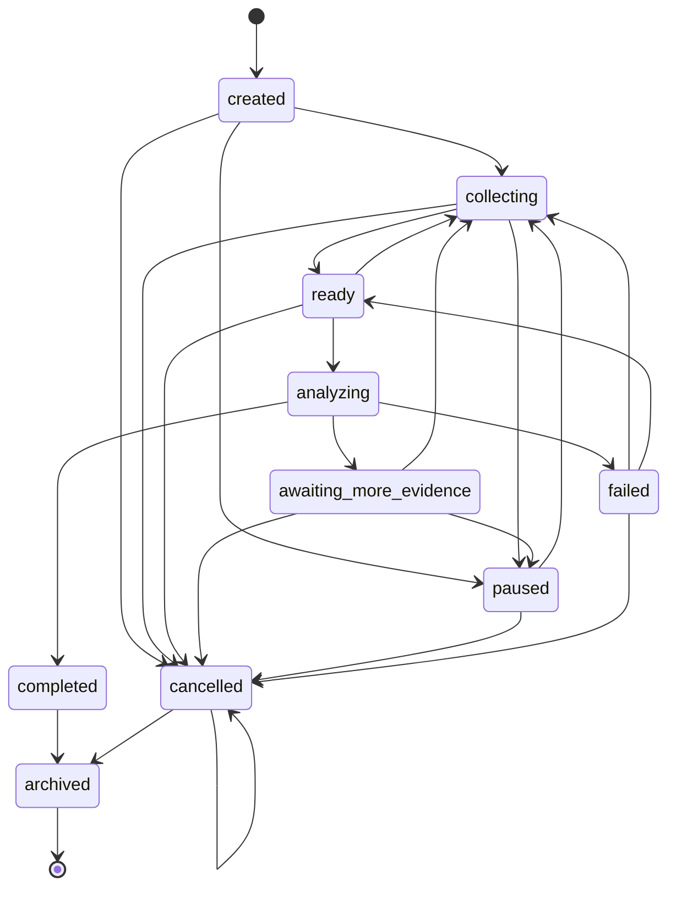
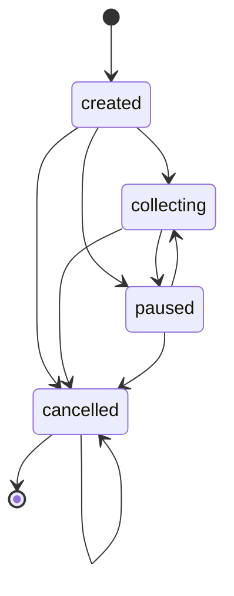
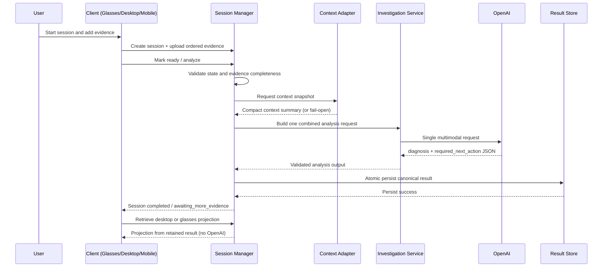

# Phase 2 System Design

## 1. Executive Summary

Phase 2 introduces a managed investigation lifecycle on top of the existing Phase 1 investigation APIs and retention architecture.

Current behavior is request-centric:

- client submits one investigation request to `POST /investigations/analyze`
- backend performs one combined multimodal OpenAI analysis
- backend persists one canonical retained result
- desktop and glasses projections are retrieved from retained data

Phase 2 shifts the product to session-centric orchestration:

- investigations are explicitly created, tracked, paused, resumed, and completed
- ordered multimodal evidence is collected before analysis
- one canonical Session Manager owns state transitions
- existing analysis logic is reused through an adapter, not duplicated

This keeps the current reliable analysis path while adding lifecycle control, better recoverability, and a clear user-facing investigation workflow.

## 1.1 Terminology Clarification

- `session_id` identifies the investigation lifecycle container.
- `investigation_id` identifies an analysis result artifact.
- Phase 2A creates and manages sessions but does not create investigation results.
- A future session may contain multiple immutable analysis revisions.
- Session `revision` is optimistic concurrency/version metadata and is not the same as analysis revision.

## 2. Product Vision

Phase 2 defines the product as a hands-free investigation assistant that combines:

- what the user is seeing (ordered images)
- what the user says is wrong (voice transcript or normalized explanation)
- what the project is doing (Context Engine and repository context)
- what evidence already exists in the session
- what exact next action should occur

Vision statement:

"Provide a session-based multimodal investigation workflow where evidence collection, analysis, and guidance are consistent across glasses and desktop, with deterministic and recoverable backend state."

## 3. Phase 2 Goals

- Add explicit investigation sessions with backend-owned lifecycle state.
- Support ordered evidence collection per session.
- Support initial image evidence plus one spoken explanation (transcript-based input).
- Validate evidence completeness and readiness before analysis.
- Preserve and expose session status transitions.
- Reuse existing Phase 1 investigation analysis logic for initial analysis.
- Support pause and resume without losing evidence or result state.
- Support controlled follow-up analysis when explicitly requested.
- Keep desktop and glasses views synchronized from the same canonical result source.
- Provide recoverable persistence for sessions, evidence metadata, and event timeline.
- Ensure transitions and result retrieval are observable and testable.

## 4. Non-Goals

Out of initial Phase 2 scope:

- Continuous video streaming.
- Unrestricted long-running autonomous recording.
- Replacing the Context Engine.
- Moving reasoning into Android or glasses-side clients.
- Per-image OpenAI analysis for initial session analysis.
- Autonomous code modification behavior.
- Unrestricted background microphone capture.
- Production-scale multi-user infrastructure.
- Vector-based historical investigation search.
- Full conversational memory across all repositories.
- Cloud production deployment changes not already independently planned.

## 5. Primary User Journeys

### 5.1 Software Debugging

Example evidence:

- VS Code source file screenshot
- browser error page screenshot
- terminal output screenshot
- spoken issue explanation

Flow:

- User action: starts a session and captures ordered screenshots while describing the issue.
- Client action: creates session, uploads evidence with sequence numbers, submits readiness.
- Backend action: validates evidence, snapshots context near analysis time, invokes one combined analysis.
- State transition: `created -> collecting -> ready -> analyzing -> completed`.
- User-visible response: concise glasses next action and detailed desktop diagnosis with Copilot prompt.

### 5.2 Hardware Troubleshooting

Example evidence:

- physical component image
- wiring image
- status LED image
- config screen image
- spoken symptoms

Flow:

- User action: captures physical troubleshooting sequence.
- Client action: preserves capture order and labels source metadata.
- Backend action: validates MIME/size/order, performs one combined analysis.
- State transition: `collecting -> ready -> analyzing -> completed` or `awaiting_more_evidence`.
- User-visible response: uncertainty-aware diagnosis and one required next action.

### 5.3 Architecture Review

Example evidence:

- architecture diagram screenshot
- code structure screenshot
- deployment configuration screenshot
- spoken concern

Flow:

- User action: opens review session and captures architecture artifacts.
- Client action: uploads evidence and explanation transcript.
- Backend action: merges context adapter snapshot and evidence into one request.
- State transition: `ready -> analyzing -> completed`.
- User-visible response: desktop detailed rationale plus concise glasses summary.

### 5.4 Pause and Resume

Flow:

- User action: pauses investigation after partial evidence collection.
- Client action: sends pause command; later queries and resumes session.
- Backend action: persists state and evidence metadata, enforces resume transition.
- State transition: `collecting -> paused -> collecting`.
- User-visible response: previous evidence and status restored; no evidence loss.

### 5.5 Insufficient Evidence

Flow:

- User action: requests analysis with weak or incomplete evidence.
- Client action: marks ready/analyze request.
- Backend action: either rejects readiness before analysis or returns uncertainty with explicit request for additional evidence.
- State transition: `ready -> analyzing -> awaiting_more_evidence`.
- User-visible response: clear request for another angle/image instead of fabricated certainty.

## 6. Canonical Session Lifecycle

Phase 2 introduces backend-owned session state machine with explicit transition validation.

Full Phase 2 designed states:

- `created`
- `collecting`
- `ready`
- `analyzing`
- `completed`
- `awaiting_more_evidence`
- `paused`
- `failed`
- `cancelled`
- `archived`

State ownership:

- Canonical owner: Session Manager (backend only).
- Clients request transitions via endpoints; clients never set raw state directly.

Entry conditions and transition rules:

- `created`: set immediately after session creation.
- `collecting`: session actively accepting evidence.
- `ready`: readiness criteria met and validated.
- `analyzing`: set immediately before OpenAI invocation.
- `completed`: valid result persisted atomically and projections available.
- `awaiting_more_evidence`: analysis cannot conclude confidently or explicit follow-up requested.
- `paused`: temporary suspension from active work states.
- `failed`: most recent operation or analysis attempt failed. The state is recoverable unless the session has also entered a separate terminal state.
- `cancelled`: terminal user cancellation state.
- `archived`: terminal retention lifecycle state.

Permitted transitions (full Phase 2 design):

- `created -> collecting | paused | cancelled`
- `collecting -> ready | paused | cancelled`
- `ready -> analyzing | collecting | cancelled`
- `analyzing -> completed | awaiting_more_evidence | failed`
- `awaiting_more_evidence -> collecting | paused | cancelled`
- `paused -> collecting | cancelled`
- `failed -> collecting | ready | cancelled`
- `completed -> archived`
- `cancelled -> cancelled | archived`

Terminal states:

- `cancelled`
- `archived`

Retry behavior:

- Recoverable failures transition to `failed` and allow explicit retry path to `collecting` or `ready`.
- Prior successful analysis revisions remain immutable.

Failed-state metadata requirements:

- `error_category`
- `retryable` (boolean)
- `occurred_at_utc`
- safe user-facing message

Failure metadata must not store secrets, raw provider responses, or sensitive stack traces in session metadata.

Invalid transitions:

- Any non-listed transition returns controlled `409 invalid_state_transition`.



### 6.1 Phase 2A Implemented State Subset

Phase 2A implements only:

- `created`
- `collecting`
- `paused`
- `cancelled`

Phase 2A state behavior:

- create session sets `created`
- first explicit start/resume-to-work transition may move to `collecting`
- pause allowed from `created` or `collecting`
- resume from `paused` moves to `collecting`
- resume from `collecting` is idempotent and returns unchanged `200`
- cancel allowed from `created`, `collecting`, or `paused`
- repeated cancel on `cancelled` is idempotent and returns unchanged `200`
- `cancelled` is terminal in Phase 2A

Future Phase 2 states that remain designed but not implemented in Phase 2A:

- `ready`
- `analyzing`
- `completed`
- `awaiting_more_evidence`
- `failed`
- `archived`



## 7. Investigation Session Manager

Phase 2 introduces Session Manager as orchestration layer.

Responsibilities:

- Create sessions and assign IDs.
- Validate and accept evidence metadata.
- Preserve evidence order and idempotency behavior.
- Enforce lifecycle transitions.
- Determine readiness for analysis.
- Invoke existing investigation analysis service via internal adapter.
- Persist canonical result references.
- Support pause/resume/cancel operations.
- Reject invalid transitions deterministically.
- Expose session and result status projections.

Explicit non-ownership:

- image capture hardware and device APIs
- OpenAI model internals
- Context Engine internals
- desktop rendering implementation
- glasses rendering implementation
- client media permission handling

## 8. Evidence Model

Phase 2 evidence is generalized and ordered.

Initial evidence types:

- `image`
- `voice_transcript`
- `context_snapshot`
- `project_context`
- `architecture_context`
- `active_task_context`

Future-compatible types (deferred):

- `terminal_output`
- `browser_screenshot`
- `log_excerpt`
- `document`
- `short_video_clip`
- `sensor_metadata`

Proposed `EvidenceItem` fields:

- `evidence_id` (required)
- `session_id` (required)
- `evidence_type` (required enum)
- `sequence_number` (required for ordered types)
- `captured_at_utc` (optional, source-provided)
- `received_at_utc` (required, backend)
- `source` (required: glasses/mobile/desktop/backend)
- `media_type` (optional, required for media evidence)
- `storage_ref` (required for media evidence)
- `content_hash` (optional but recommended for dedupe)
- `size_bytes` (optional)
- `normalized_text` (optional transcript/text)
- `metadata` (optional bounded dict)
- `validation_status` (required enum)

Storage rule:

- Raw image bytes are stored in media files/object refs, not in primary session metadata record.

Ordering:

- `sequence_number` is backend-validated as strictly increasing for image evidence.
- Backend is canonical ordering authority.

Duplicate detection:

- Use `content_hash` plus optional idempotency key for client retry safety.
- Duplicate upload can return `200 duplicate_accepted` with original evidence reference.

Deletion and replacement:

- Allow deletion or replacement only in `collecting` or `awaiting_more_evidence`.
- Do not mutate evidence already bound to completed analysis revision; create new revision instead.

## 9. Voice Evidence Design

Initial voice workflow (bounded):

- One spoken explanation for initial analysis.
- Store transcript or normalized text as canonical voice evidence.
- Retain raw audio only if explicitly configured and policy-approved.
- Track whether transcript is auto-generated vs user-edited.
- Allow correction/replacement before `ready`.
- Explicit max duration and no indefinite recording.

Design decisions:

- Transcription ownership: backend adapter layer, with source metadata indicating origin (Meta/native/backend).
- Failure behavior: transcription failure keeps session in `collecting` and returns recoverable error.
- Consent: client must provide explicit user action to start voice capture.
- Retention policy: transcript retained with session; raw audio optional and bounded by TTL.
- Maximum duration recommendation: 60 seconds for initial Phase 2B.

Unresolved platform verification:

- Whether Meta platform provides exportable transcript directly.
- Whether raw audio transfer from Meta workflow is available and reliable.
- Whether Android/iOS companion must perform transcription before upload.

## 10. Image Capture Design

Grounded current limits:

- Existing Phase 1 investigation analysis requires 2 to 3 images and supports JPEG/PNG.

Phase 2 recommendation:

- For first Phase 2 implementation that invokes existing service, keep analysis-ready image limits at 2 to 3.
- Allow Session Manager to accept up to 5 image evidence items in collection state only if readiness policy selects exactly 2 to 3 for initial analysis.

Validation design:

- MIME allowlist: `image/jpeg`, `image/png`.
- Filename sanitation via basename normalization.
- Size limits: enforce per-file max and session cumulative max.
- Orientation metadata: preserve as evidence metadata for downstream preprocessing.
- Duplicate handling: hash-based duplicate detection.
- Partial uploads: keep valid accepted evidence; reject invalid items with explicit per-item error.
- Retries: idempotency key per evidence upload request.
- Post-analysis lifecycle: retain references for reproducibility; archive raw media per retention policy.

## 11. Proposed Data Models

Conceptual schemas (non-code):

### InvestigationSession (persisted)

Required:

- `session_id`
- `created_at_utc`
- `updated_at_utc`
- `state`
- `revision`
- `owner_context` (prototype may be anonymous/single-user)
- `schema_version`

Optional:

- `title`
- `source_client`
- `active_analysis_revision`
- `last_error`
- `last_resumable_state` (for future non-Phase 2A resumes)

Validation:

- state must be allowed enum
- timestamps UTC ISO8601
- `revision` integer must increase on every successful mutation

Failure metadata (`last_error`) shape:

- `error_category`
- `retryable`
- `occurred_at_utc`
- `safe_message`

Failure metadata exclusions:

- no secrets
- no raw provider responses
- no sensitive stack traces

Must not store:

- raw image bytes
- API keys

### EvidenceItem (persisted)

Required:

- `evidence_id`
- `session_id`
- `evidence_type`
- `received_at_utc`
- `validation_status`

Optional:

- `sequence_number`
- `storage_ref`
- `content_hash`
- `normalized_text`
- `metadata`

Validation:

- sequence constraints by evidence type
- bounded metadata size

Must not store:

- unrestricted raw binary in session metadata JSON

### SessionAnalysisRequest (computed)

Required:

- `session_id`
- `selected_image_evidence_refs`
- `user_explanation_text`
- `context_snapshot_ref_or_compact`

Optional:

- `analysis_reason`
- `requested_by`

### SessionAnalysisResultReference (persisted)

Required:

- `result_id`
- `session_id`
- `analysis_revision`
- `retained_result_ref`
- `created_at_utc`

Optional:

- `previous_result_id`
- `evidence_set_hash`

### SessionEvent (persisted)

Required:

- `event_id`
- `session_id`
- `event_type`
- `timestamp_utc`

Optional:

- `actor`
- `details`
- `correlation_id`

### SessionSummary (computed projection)

Required:

- `session_id`
- `state`
- `evidence_counts`
- `last_updated_utc`

Optional:

- `latest_result_status`
- `readiness_status`
- `last_action`

Persisted vs computed:

- Persist session/evidence/events/result references.
- Compute readiness, summary counters, and client projections on read.

## 12. Proposed API Contracts

Phase 2 endpoint proposal with scope decisions.

### Phase 2A approved endpoints

Phase 2A endpoint list:

- `POST /investigation-sessions`
- `GET /investigation-sessions/{session_id}`
- `POST /investigation-sessions/{session_id}/pause`
- `POST /investigation-sessions/{session_id}/resume`
- `POST /investigation-sessions/{session_id}/cancel`

Phase 2A contract guarantees:

- zero OpenAI calls
- zero Context Engine calls
- validated request/response models
- controlled `404`, `409`, `422`, and `500` responses as applicable
- existing Phase 1 endpoints remain unchanged

Mutation concurrency contract (Phase 2A):

- request may include `expected_revision`
- if provided and mismatch occurs, return `409 conflict`
- omission may be accepted in earliest local prototype, but inclusion is recommended in mutation contracts
- successful mutation increments session `revision`

1) `POST /investigation-sessions`

- Purpose: create session and initialize state.
- Invokes OpenAI: no.
- Invokes Context Engine: no.
- Allowed states: N/A (create).
- Idempotency: optional client idempotency key; duplicate returns existing session.
- Success: `201` created.
- Errors: `409`, `422`, `500`.

2) `GET /investigation-sessions/{session_id}`

- Purpose: retrieve canonical session status and summary.
- Invokes OpenAI: no.
- Invokes Context Engine: no.
- Allowed states: all.
- Success: `200`.
- Errors: `404`, `500`.

3) `POST /investigation-sessions/{session_id}/pause`

- Purpose: transition to paused.
- Invokes OpenAI: no.
- Invokes Context Engine: no.
- Allowed states (Phase 2A): `created`, `collecting`.
- Idempotency: repeat pause returns `200` with unchanged state.
- Success: `200`.
- Errors: `404`, `409`, `422`, `500`.

4) `POST /investigation-sessions/{session_id}/resume`

- Purpose: resume work state.
- Invokes OpenAI: no.
- Invokes Context Engine: no.
- Allowed states (Phase 2A): `paused`, `collecting`.
- Behavior:
    - from `paused`: transition to resumable working state, default `collecting` for Phase 2A
    - from `collecting`: idempotent no-op with unchanged current session
    - all other states: `409 invalid_state_transition`
- Success: `200`.
- Errors: `404`, `409`, `422`, `500`.

5) `POST /investigation-sessions/{session_id}/cancel`

- Purpose: cancel active session.
- Invokes OpenAI: no.
- Invokes Context Engine: no.
- Allowed states (Phase 2A): `created`, `collecting`, `paused`, `cancelled`.
- Idempotency: repeated cancel on `cancelled` returns `200` unchanged.
- Success: `200`.
- Errors: `404`, `409`, `422`, `500`.

### Phase 2B candidate endpoints (defer from 2A)

6) `POST /investigation-sessions/{session_id}/evidence`

- Purpose: upload evidence metadata/media.
- OpenAI: no.
- Allowed states: `collecting`, `awaiting_more_evidence`.

7) `DELETE /investigation-sessions/{session_id}/evidence/{evidence_id}`

- Purpose: remove mutable evidence before analysis.
- OpenAI: no.

8) `POST /investigation-sessions/{session_id}/ready`

- Purpose: readiness validation and transition to ready.
- OpenAI: no.

### Phase 2C candidate endpoints (defer from 2A)

9) `POST /investigation-sessions/{session_id}/analyze`

- Purpose: trigger one combined analysis using existing service adapter.
- OpenAI: yes, exactly one request.
- Allowed states: `ready`.

10) `GET /investigation-sessions/{session_id}/result`

- Purpose: desktop projection retrieval from retained result reference.
- OpenAI: no.

11) `GET /investigation-sessions/{session_id}/result/glasses`

- Purpose: concise glasses projection retrieval.
- OpenAI: no.

12) `GET /investigation-sessions/latest`

- Purpose: convenience lookup for most recent session.
- OpenAI: no.

Preservation requirement:

- Keep existing `POST /investigations/analyze`, `GET /investigations/latest`, and `GET /investigations/latest/glasses` unchanged.
- Session Manager should call existing investigation service internally for initial analysis path, not duplicate reasoning logic.

Authentication expectations:

- Phase 2A lifecycle endpoints reuse the existing optional `GLASSES_API_TOKEN` mechanism.
- When `GLASSES_API_TOKEN` is configured, enforce the same accepted token presentation already supported by current API behavior.
- When `GLASSES_API_TOKEN` is not configured, preserve current local-development behavior.
- Authentication enforcement is in the backend API layer.
- Do not introduce a second token system in Phase 2A.
- Session ownership and multi-user authorization remain deferred production concerns.

## 13. Initial Analysis Flow

1. Session created.
2. Evidence collected in order.
3. Evidence validated.
4. Readiness determined by Session Manager.
5. Context snapshot requested near analysis time through adapter.
6. Combined analysis request built from selected evidence + transcript + context summary.
7. Exactly one OpenAI multimodal call performed through existing analysis service.
8. Model response validated against existing investigation schema constraints.
9. Canonical result created.
10. Canonical result persisted atomically.
11. Session transitions to `completed` or `awaiting_more_evidence`.
12. Desktop and glasses projections become available from retained result.



## 14. Follow-Up Investigation Design

Follow-up modes:

- Result Q&A without re-analysis.
- Add evidence without immediate re-analysis.
- Explicit request for revised diagnosis.
- Resume paused collection.

OpenAI call policy:

- Retrieval-only and Q&A over existing retained result: no OpenAI required by default.
- New OpenAI reasoning allowed only when user requests follow-up reasoning or new evidence requires re-analysis.

Revision traceability proposal:

- `analysis_revision` (integer)
- `previous_result_id` (link)
- `evidence_set_hash` (deterministic hash of included evidence refs)

Prior revisions remain immutable and retrievable.

## 15. Persistence and Recovery

Persisted domains:

- session metadata
- evidence metadata
- canonical retained results
- session events
- temporary uploads

Prototype storage recommendation (Phase 2A-2C):

- Filesystem JSON persistence with atomic writes and lock discipline, consistent with current Phase 1 patterns.

### Phase 2A Filesystem Storage Contract

Storage root:

- `code/prototype_v1/results/investigation_sessions/`

Layout:

```text
investigation_sessions/
    sessions/
        <session_id>.json
    corrupt/
    archive/
    temp/
```

Phase 2A normative rules:

- one JSON file per session
- filename derived only from server-generated validated session ID
- no user-supplied path fragments
- writes use all steps below in the same filesystem:
    1. create temp file
    2. serialize validated model
    3. flush
    4. fsync
    5. atomic replace
- failed writes preserve previous valid session file
- temporary files are cleaned up on controlled failure where possible
- malformed session files are not silently overwritten
- malformed files are moved or copied to `corrupt/` with safe server-generated name
- API returns controlled storage error when corruption is detected
- archived sessions move to `archive/`
- Phase 2A does not require global index file
- individual lookup is by session ID
- latest-session listing may be deferred to later milestone
- store access occurs only through one session repository abstraction
- tests must use isolated temporary root, never production path

Concurrency rules (Phase 2A):

- single process, single canonical backend writer
- multiple readers allowed
- per-session writes serialized
- conflicting concurrent writes surface controlled conflict
- no distributed locking introduced
- multi-process deployment requires stronger store or database

Paused-session lifetime policy (Phase 2A):

- paused sessions do not expire automatically
- sessions remain resumable until cancelled, archived by explicit future operation, or manually removed under documented maintenance policy
- no background cleanup job is part of Phase 2A
- timestamps are retained to support future stale-session policy if introduced in later milestone

Recovery behaviors:

- Atomic writes prevent partial canonical result replacement.
- Startup recovery scans for orphaned temp uploads and stale locks.
- Corrupted metadata returns controlled errors and preserves prior valid artifacts.
- Interrupted uploads produce explicit failed evidence events without corrupting session state.
- Retention/archival policy moves completed sessions to archived state and bounded storage.

When database migration is justified:

- multiple backend processes
- multiple users or tenants
- high session volume
- query/search requirements
- transactional multi-record operations
- remote deployment requiring shared storage

## 16. Context Engine Integration

Integration model:

- Session Manager requests context through a stable adapter boundary.
- Context Engine remains independent and testable.
- Session records store bounded context summary or reference, not raw full internal payload by default.
- Context failure is fail-open for session continuity unless policy marks context mandatory.
- Context staleness is explicit and separated from result freshness.
- Context capture should occur near analysis invocation time.

Context relation to evidence:

- Evidence explains what user observed.
- Context explains current project and workflow state.
- Combined request uses both, with context as supporting signal and evidence as primary source.

## 17. Client Responsibilities

### Meta Ray-Ban Display or Meta client

- initiate voice command or capture action
- capture images through supported platform path
- present concise status and next action
- avoid backend business logic

### Android companion or test client

- manage media permissions
- create and manage sessions
- upload evidence with retries and idempotency
- track local upload progress and failures
- apply authentication tokens
- respect platform foreground/background constraints

### Desktop web interface

- provide detailed session visibility
- show ordered evidence and readiness state
- show diagnosis, next action, and Copilot prompt
- expose pause/resume/retry controls
- surface developer diagnostics

### Backend

- own canonical session state transitions
- validate evidence and requests
- orchestrate OpenAI invocation policy
- persist and recover session/result artifacts
- serve desktop and glasses projections
- enforce auth and limits

Platform verification caveat:

- Do not assume unsupported direct Meta SDK display or capture APIs; treat these as verification gates.

## 18. Security and Privacy

Prototype-proportionate controls:

- Phase 2A lifecycle endpoint authentication reuses optional `GLASSES_API_TOKEN` mechanism.
- when configured, require currently accepted token presentation behavior at backend API layer.
- when not configured, preserve local-development behavior.
- do not create a second token system in Phase 2A.
- session ownership policy (single-user prototype default, explicit multi-user defer).
- upload MIME and size validation.
- filename sanitation and path traversal prevention.
- temporary-file isolation under controlled directories.
- transcript privacy controls and optional raw audio retention toggle.
- image retention and deletion policy.
- log redaction for secrets and sensitive text.
- strict API key non-persistence in session artifacts.
- explicit local-network vs public-tunnel risk posture.
- cloud tunnel hardening notes for cloudflared/ngrok exposure.
- rate limiting and replay protection.
- idempotency keys for mutation endpoints.
- explicit deletion and archive behavior.

Production gaps to track:

- no tenant isolation
- no per-user ownership
- no token rotation workflow
- no scoped permissions
- robust authz per session owner
- transport-level hardening for internet-exposed tunnels
- central secret management beyond local env files

## 19. Failure Handling

Failure matrix:

| Failure | Backend behavior | Session state | Client-visible message | Retryable | Prior valid data preserved |
|---|---|---|---|---|---|
| session not found | return 404 | unchanged | Session not found | no | yes |
| invalid transition | return 409 | unchanged | Invalid state transition | yes (correct state) | yes |
| revision mismatch (`expected_revision` conflict) | return 409 conflict | unchanged | Session was updated elsewhere; refresh and retry | yes | yes |
| resume called outside `paused` or `collecting` | return 409 invalid_state_transition | unchanged | Session cannot be resumed from current state | yes | yes |
| repeated cancel on `cancelled` | return 200 unchanged | `cancelled` | Session already cancelled | not needed | yes |
| failed operation metadata recorded | store safe `last_error` fields only | `failed` | Operation failed; retry guidance provided | yes if `retryable=true` | yes |
| unsupported evidence type | reject evidence | unchanged | Unsupported evidence type | yes | yes |
| duplicate evidence | accept as duplicate or no-op | unchanged | Duplicate evidence already recorded | yes | yes |
| image too large | reject evidence | unchanged | Image exceeds size limit | yes | yes |
| transcription failure | reject voice evidence item | collecting | Voice transcription failed | yes | yes |
| Context Engine unavailable | fail-open with context missing/stale | analyzing continues | Context unavailable, analysis continuing | yes | yes |
| OpenAI timeout | controlled 504 | failed or awaiting_more_evidence | Analysis timed out | yes | yes |
| invalid model response | controlled 502 mapping | failed | Invalid analysis response | yes | yes |
| persistence failure | controlled 500 | failed | Result persistence failed | yes | yes |
| client disconnect | cancel in-flight upload chunk | collecting | Upload interrupted | yes | yes |
| interrupted upload | partial temp cleanup + reject item | collecting | Upload incomplete | yes | yes |
| stale session policy not implemented in Phase 2A | no automatic expiry transition | unchanged | Session remains resumable until explicit action | yes | yes |
| corrupted retained data | controlled retrieval error | completed (data error flagged) | Retained data unavailable | yes (repair path) | previous valid artifacts if available |

## 20. Observability

Proposed structured events:

- `session_created`
- `evidence_received`
- `evidence_rejected`
- `session_ready`
- `analysis_started`
- `analysis_completed`
- `analysis_failed`
- `session_paused`
- `session_resumed`
- `result_retrieved`

Each event should include:

- `correlation_id`
- `session_id`
- `investigation_id` (if available)
- `duration_ms` (where applicable)
- `evidence_count`
- `openai_call_count`
- `error_category` (if failure)

Logging policy:

- do not log raw images
- do not log API keys
- do not log full transcripts by default
- do not log sensitive full context payloads by default

## 21. Testing Strategy

### Unit tests

- state transition validator
- Phase 2A subset transition validator (`created`, `collecting`, `paused`, `cancelled`)
- readiness rules
- evidence ordering and dedupe logic
- idempotency key behavior
- hash/evidence-set revision generation
- failed-state metadata validation (`error_category`, `retryable`, `occurred_at_utc`, safe message only)

### API integration tests

- create/status/pause/resume/cancel flow
- invalid transitions
- resume from `paused` transitions to `collecting`
- resume from `collecting` returns unchanged `200`
- resume from other states returns `409 invalid_state_transition`
- repeated cancel on `cancelled` returns unchanged `200`
- `expected_revision` mismatch returns `409 conflict`
- evidence upload validation
- analyze invocation from ready state only
- one OpenAI call for initial analysis
- zero OpenAI calls for retrieval
- Phase 2A lifecycle endpoints: zero OpenAI and zero Context Engine calls
- Phase 2A auth checks using optional `GLASSES_API_TOKEN` behavior

### Persistence tests

- atomic write behavior
- Phase 2A storage layout and file naming enforcement
- malformed session file quarantine to `corrupt/` and controlled error response
- crash recovery for temp artifacts
- corrupted metadata handling
- startup recovery scan behavior
- isolated temporary root usage only (never production path)

### UI tests

- desktop session state rendering
- glasses concise status consistency
- projection consistency for same result revision

### Mobile/client tests

- retry semantics
- upload interruption handling
- idempotent re-send behavior

### Live smoke tests

- end-to-end session from create to completed
- pause/resume continuity
- follow-up request behavior without forced re-analysis
- regression of existing Phase 1 endpoints

## 22. Phase 2 Milestones

### Phase 2A - Session Lifecycle Foundation

Objective:

- establish canonical session state machine and persistence without new analysis behavior

Deliverables:

- InvestigationSession model
- state enum and transition validator
- session store/repository (filesystem)
- create/status/pause/resume/cancel endpoints
- session event logging
- revision-based conflict detection for mutation endpoints
- optional `GLASSES_API_TOKEN` auth enforcement parity with existing API behavior

Dependencies:

- existing FastAPI runtime and results directory conventions

Non-goals:

- evidence uploads
- OpenAI analysis changes
- Context Engine calls from Phase 2A endpoints

Acceptance criteria:

- invalid transitions rejected with deterministic errors
- Phase 2A states implemented: `created`, `collecting`, `paused`, `cancelled`
- resume contract: `paused -> collecting`, `collecting` idempotent `200`, other states `409`
- repeated cancel on `cancelled` returns unchanged `200`
- all Phase 2A endpoints perform zero OpenAI and zero Context Engine calls
- session writes follow Phase 2A filesystem storage contract with atomic replace semantics
- optional `GLASSES_API_TOKEN` auth policy enforced at API layer when configured
- controlled `404`, `409`, `422`, `500` behavior on lifecycle endpoints
- lifecycle endpoints pass integration tests
- no regression to existing Phase 1 routes

Tests:

- unit transition tests
- API lifecycle tests
- persistence/read-recovery tests
- conflict and idempotency tests (`expected_revision`, resume, cancel)
- auth enforcement parity tests for configured/unconfigured token modes

Implementation risk:

- moderate (state model correctness)

### Phase 2B - Evidence Collection

Objective:

- introduce ordered evidence ingestion and readiness validation

Deliverables:

- EvidenceItem model and store
- evidence upload endpoint
- evidence delete endpoint (pre-analysis states only)
- readiness endpoint and validation rules

Dependencies:

- Phase 2A session/state foundation

Non-goals:

- follow-up analysis revisions

Acceptance criteria:

- evidence order preserved and retrievable
- duplicate evidence behavior deterministic

Tests:

- upload, dedupe, delete, readiness tests

Implementation risk:

- moderate (upload durability and idempotency)

### Phase 2C - Session Analysis Integration

Objective:

- connect Session Manager to existing investigation analysis path

Deliverables:

- analyze endpoint by session state
- internal adapter to existing service (`analyze_investigation_request_with_retained` path)
- canonical session-result references
- desktop and glasses session result retrieval endpoints

Dependencies:

- Phase 2B readiness and evidence records
- existing investigation service and result projection logic

Non-goals:

- replacing Phase 1 analysis endpoints

Acceptance criteria:

- one OpenAI request for initial analysis
- zero OpenAI on retrieval
- atomic result persistence retained

Tests:

- analyze lifecycle tests
- call-count tests
- projection consistency tests

Implementation risk:

- medium-high (orchestration correctness)

### Phase 2D - Glasses and Android Interaction

Objective:

- improve real capture-client integration and user feedback loops

Deliverables:

- client upload status contract
- concise glasses session status presentation
- retry guidance behaviors

Dependencies:

- platform capability verification

Non-goals:

- backend reasoning on client side

Acceptance criteria:

- session status understandable on glasses and desktop
- retry behavior consistent with backend state

Tests:

- client integration smoke tests

Implementation risk:

- high (platform capability constraints)

### Phase 2E - Follow-Up and Resume

Objective:

- enable controlled re-analysis and revision history

Deliverables:

- follow-up reasoning endpoint policy
- revision linkage and evidence-set hash
- prior result traceability

Dependencies:

- stable session and evidence model

Non-goals:

- unrestricted chatbot memory

Acceptance criteria:

- prior revisions immutable and queryable
- re-analysis only on explicit trigger

Tests:

- revision chain tests
- retrieval and no-op follow-up tests

Implementation risk:

- medium (history consistency)

## 23. Phase 2A Recommended Scope

Recommended Phase 2A implementation scope:

Include:

- InvestigationSession persisted model
- explicit lifecycle state enum
- session repository/store with atomic writes
- `POST /investigation-sessions`
- `GET /investigation-sessions/{session_id}`
- `POST /investigation-sessions/{session_id}/pause`
- `POST /investigation-sessions/{session_id}/resume`
- `POST /investigation-sessions/{session_id}/cancel`
- strict transition validator and controlled errors
- unit and API tests for lifecycle transitions
- documentation updates

Phase 2A implementation state list:

- `created`
- `collecting`
- `paused`
- `cancelled`

Phase 2A endpoint behavior constraints:

- endpoints are limited to create/retrieve/pause/resume/cancel
- zero OpenAI calls
- zero Context Engine calls
- validated models in request/response contracts
- controlled `404`, `409`, `422`, `500` responses as applicable
- preserve all existing Phase 1 endpoints unchanged

Do not include in 2A:

- image uploads
- audio uploads
- OpenAI calls
- new Context Engine feature work
- Android implementation work
- follow-up conversational behavior
- future states implementation (`ready`, `analyzing`, `completed`, `awaiting_more_evidence`, `failed`, `archived`)

Repository-based rationale:

- Current investigation analysis and retention path is stable and validated.
- Session lifecycle can be added safely as orchestration scaffolding before changing evidence ingestion paths.

## 24. Open Design Questions

| Question | Why it matters | Recommended default | Decision needed before milestone |
|---|---|---|---|
| What Meta SDK capture capabilities are actually available to custom clients? | Defines feasible client capture flow | Assume backend-agnostic upload client path first | Phase 2D |
| What transcript source will be canonical across clients (Meta native vs companion vs backend transcription)? | Affects consistency and trust model | Normalize transcript source metadata and validate provenance | Phase 2B |
| Where should raw evidence media be stored? | Affects persistence and privacy | Filesystem under bounded session directories for prototype | Phase 2B |
| Should raw audio be retained? | Privacy and storage risk | Default no raw retention; transcript only | Phase 2B |
| What is maximum image count per session? | Performance and UX | Collect up to 5, analyze selected 2 to 3 initially | Phase 2B |
| When does re-analysis become a new investigation? | Product consistency | New revision within same session unless user explicitly starts new session | Phase 2E |
| How should accidental duplicate captures be handled? | Prevents evidence noise | hash+idempotency dedupe with duplicate-accepted response | Phase 2B |
| What evidence retention window and archival policy should apply to media and transcripts? | Privacy, storage, and compliance tradeoffs | Keep prototype bounded retention with explicit archive policies | Phase 2B |
| What multi-user ownership and authorization model is required for production? | Security boundary and access control correctness | Defer to production authz design with owner-scoped permissions | Pre-production |
| When should database migration occur beyond explicit triggers? | Determines operational readiness boundary | Trigger on multi-process, multi-user, query/search, scale, shared-storage, or multi-record transaction requirements | Phase 2C+ planning |

## 25. Architecture Decision Summary

| Decision | Status | Notes |
|---|---|---|
| Session Manager is canonical state owner | accepted | Backend enforces transitions; clients request intents only |
| Phase 2A implemented state list is `created`, `collecting`, `paused`, `cancelled` | accepted | Full lifecycle design remains documented for later milestones |
| Phase 2A endpoints are create/retrieve/pause/resume/cancel only | accepted | No evidence or analysis endpoints in Phase 2A implementation |
| Preserve existing Phase 1 investigation endpoints | accepted | No contract changes to current analyze/latest routes |
| Reuse existing investigation service for initial session analysis | accepted | Avoid duplicated OpenAI orchestration |
| One OpenAI call for initial analysis | accepted | Maintains Phase 1 invariant |
| Retrieval endpoints never call OpenAI | accepted | Keep projection-only retrieval pattern |
| One atomically written JSON file per session for Phase 2A | accepted | Server-generated UUID session IDs under defined storage contract |
| Session ID is server-generated UUID | accepted | Filename derived from validated session ID only |
| Timestamp policy is timezone-aware UTC | accepted | All lifecycle and failure timestamps use UTC |
| Resume in `collecting` and cancel in `cancelled` are idempotent unchanged `200` responses | accepted | Deterministic idempotency for lifecycle endpoints |
| Phase 2A authentication reuses optional `GLASSES_API_TOKEN` mechanism | accepted | No second token system in Phase 2A |
| Concurrency is single backend writer, multiple readers, revision-based conflict detection | accepted | `expected_revision` recommended for mutation contracts |
| Paused sessions do not auto-expire in Phase 2A | accepted | No background cleanup job in Phase 2A |
| Cancelled is terminal and idempotent | accepted | Repeated cancel returns unchanged `200` |
| Completed-session mutability decision is deferred because `completed` is not a Phase 2A state | accepted | Address in Phase 2E revision model |
| Session/result identity split: `session_id` lifecycle vs `investigation_id` analysis result | accepted | Session revision is distinct from analysis revision |
| Database migration trigger set is explicit | accepted | Trigger on multi-process, multi-user, query/search, scale, shared-storage, or transactional needs |
| Support up to 5 collected images but analyze selected 2 to 3 initially | recommended | Preserves current analysis limits while enabling session collection growth |
| Raw audio retention disabled by default | recommended | Privacy-first prototype posture |
| Follow-up revision model with immutable prior results | deferred | Target Phase 2E |
| Direct Meta display SDK assumptions | requires verification | Platform capability gate before Phase 2D |
