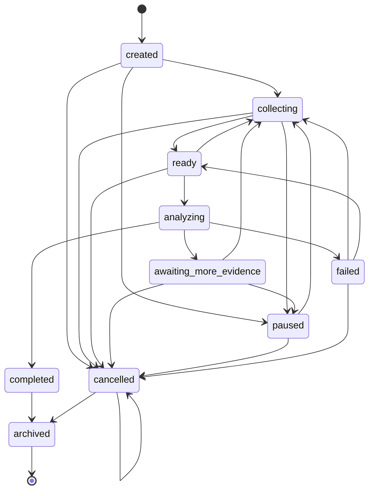
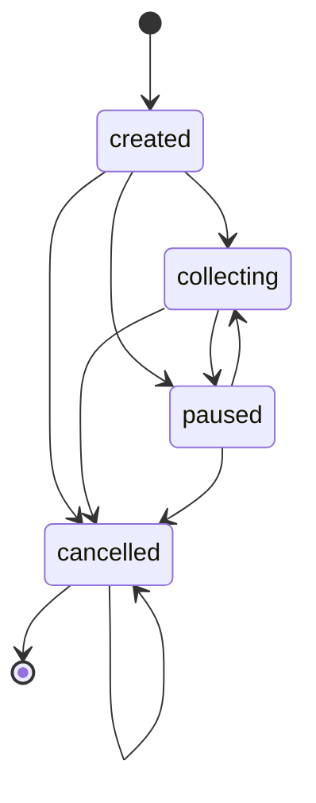
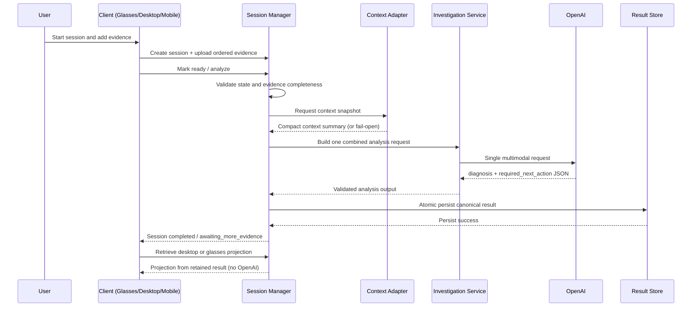

# Phase 2 System Design

## 1. Executive Summary

Phase 2 introduces a managed investigation lifecycle on top of the existing Phase 1 investigation APIs and retention architecture.

Current behavior is request-centric:

- client submits one investigation request to `POST /investigations/analyze`
- backend performs one combined multimodal OpenAI analysis
- backend persists one canonical retained result
- desktop and glasses projections are retrieved from retained data

Phase 2 shifts the product to session-centric orchestration:

- investigations are explicitly created, tracked, paused, resumed, and completed
- ordered multimodal evidence is collected before analysis
- one canonical Session Manager owns state transitions
- existing analysis logic is reused through an adapter, not duplicated

This keeps the current reliable analysis path while adding lifecycle control, better recoverability, and a clear user-facing investigation workflow.

## 1.1 Terminology Clarification

- `session_id` identifies the investigation lifecycle container.
- `investigation_id` identifies an analysis result artifact.
- Phase 2A creates and manages sessions but does not create investigation results.
- A future session may contain multiple immutable analysis revisions.
- Session `revision` is optimistic concurrency/version metadata and is not the same as analysis revision.

## 2. Product Vision

Phase 2 defines the product as a hands-free investigation assistant that combines:

- what the user is seeing (ordered images)
- what the user says is wrong (voice transcript or normalized explanation)
- what the project is doing (Context Engine and repository context)
- what evidence already exists in the session
- what exact next action should occur

Vision statement:

"Provide a session-based multimodal investigation workflow where evidence collection, analysis, and guidance are consistent across glasses and desktop, with deterministic and recoverable backend state."

## 3. Phase 2 Goals

- Add explicit investigation sessions with backend-owned lifecycle state.
- Support ordered evidence collection per session.
- Support initial image evidence plus one spoken explanation (transcript-based input).
- Validate evidence completeness and readiness before analysis.
- Preserve and expose session status transitions.
- Reuse existing Phase 1 investigation analysis logic for initial analysis.
- Support pause and resume without losing evidence or result state.
- Support controlled follow-up analysis when explicitly requested.
- Keep desktop and glasses views synchronized from the same canonical result source.
- Provide recoverable persistence for sessions, evidence metadata, and event timeline.
- Ensure transitions and result retrieval are observable and testable.

## 4. Non-Goals

Out of initial Phase 2 scope:

- Continuous video streaming.
- Unrestricted long-running autonomous recording.
- Replacing the Context Engine.
- Moving reasoning into Android or glasses-side clients.
- Per-image OpenAI analysis for initial session analysis.
- Autonomous code modification behavior.
- Unrestricted background microphone capture.
- Production-scale multi-user infrastructure.
- Vector-based historical investigation search.
- Full conversational memory across all repositories.
- Cloud production deployment changes not already independently planned.

## 5. Primary User Journeys

### 5.1 Software Debugging

Example evidence:

- VS Code source file screenshot
- browser error page screenshot
- terminal output screenshot
- spoken issue explanation

Flow:

- User action: starts a session and captures ordered screenshots while describing the issue.
- Client action: creates session, uploads evidence with sequence numbers, submits readiness.
- Backend action: validates evidence, snapshots context near analysis time, invokes one combined analysis.
- State transition: `created -> collecting -> ready -> analyzing -> completed`.
- User-visible response: concise glasses next action and detailed desktop diagnosis with Copilot prompt.

### 5.2 Hardware Troubleshooting

Example evidence:

- physical component image
- wiring image
- status LED image
- config screen image
- spoken symptoms

Flow:

- User action: captures physical troubleshooting sequence.
- Client action: preserves capture order and labels source metadata.
- Backend action: validates MIME/size/order, performs one combined analysis.
- State transition: `collecting -> ready -> analyzing -> completed` or `awaiting_more_evidence`.
- User-visible response: uncertainty-aware diagnosis and one required next action.

### 5.3 Architecture Review

Example evidence:

- architecture diagram screenshot
- code structure screenshot
- deployment configuration screenshot
- spoken concern

Flow:

- User action: opens review session and captures architecture artifacts.
- Client action: uploads evidence and explanation transcript.
- Backend action: merges context adapter snapshot and evidence into one request.
- State transition: `ready -> analyzing -> completed`.
- User-visible response: desktop detailed rationale plus concise glasses summary.

### 5.4 Pause and Resume

Flow:

- User action: pauses investigation after partial evidence collection.
- Client action: sends pause command; later queries and resumes session.
- Backend action: persists state and evidence metadata, enforces resume transition.
- State transition: `collecting -> paused -> collecting`.
- User-visible response: previous evidence and status restored; no evidence loss.

### 5.5 Insufficient Evidence

Flow:

- User action: requests analysis with weak or incomplete evidence.
- Client action: marks ready/analyze request.
- Backend action: either rejects readiness before analysis or returns uncertainty with explicit request for additional evidence.
- State transition: `ready -> analyzing -> awaiting_more_evidence`.
- User-visible response: clear request for another angle/image instead of fabricated certainty.

## 6. Canonical Session Lifecycle

Phase 2 introduces backend-owned session state machine with explicit transition validation.

Full Phase 2 designed states:

- `created`
- `collecting`
- `ready`
- `analyzing`
- `completed`
- `awaiting_more_evidence`
- `paused`
- `failed`
- `cancelled`
- `archived`

State ownership:

- Canonical owner: Session Manager (backend only).
- Clients request transitions via endpoints; clients never set raw state directly.

Entry conditions and transition rules:

- `created`: set immediately after session creation.
- `collecting`: session actively accepting evidence.
- `ready`: readiness criteria met and validated.
- `analyzing`: set immediately before OpenAI invocation.
- `completed`: valid result persisted atomically and projections available.
- `awaiting_more_evidence`: analysis cannot conclude confidently or explicit follow-up requested.
- `paused`: temporary suspension from active work states.
- `failed`: most recent operation or analysis attempt failed. The state is recoverable unless the session has also entered a separate terminal state.
- `cancelled`: terminal user cancellation state.
- `archived`: terminal retention lifecycle state.

Permitted transitions (full Phase 2 design):

- `created -> collecting | paused | cancelled`
- `collecting -> ready | paused | cancelled`
- `ready -> analyzing | collecting | cancelled`
- `analyzing -> completed | awaiting_more_evidence | failed`
- `awaiting_more_evidence -> collecting | paused | cancelled`
- `paused -> collecting | cancelled`
- `failed -> collecting | ready | cancelled`
- `completed -> archived`
- `cancelled -> cancelled | archived`

Terminal states:

- `cancelled`
- `archived`

Retry behavior:

- Recoverable failures transition to `failed` and allow explicit retry path to `collecting` or `ready`.
- Prior successful analysis revisions remain immutable.

Failed-state metadata requirements:

- `error_category`
- `retryable` (boolean)
- `occurred_at_utc`
- safe user-facing message

Failure metadata must not store secrets, raw provider responses, or sensitive stack traces in session metadata.

Invalid transitions:

- Any non-listed transition returns controlled `409 invalid_state_transition`.



### 6.1 Phase 2A Implemented State Subset

Phase 2A implements only:

- `created`
- `collecting`
- `paused`
- `cancelled`

Phase 2A state behavior:

- create session sets `created`
- first explicit start/resume-to-work transition may move to `collecting`
- pause allowed from `created` or `collecting`
- resume from `paused` moves to `collecting`
- resume from `collecting` is idempotent and returns unchanged `200`
- cancel allowed from `created`, `collecting`, or `paused`
- repeated cancel on `cancelled` is idempotent and returns unchanged `200`
- `cancelled` is terminal in Phase 2A

Future Phase 2 states that remain designed but not implemented in Phase 2A:

- `ready`
- `analyzing`
- `completed`
- `awaiting_more_evidence`
- `failed`
- `archived`



## 7. Investigation Session Manager

Phase 2 introduces Session Manager as orchestration layer.

Responsibilities:

- Create sessions and assign IDs.
- Validate and accept evidence metadata.
- Preserve evidence order and idempotency behavior.
- Enforce lifecycle transitions.
- Determine readiness for analysis.
- Invoke existing investigation analysis service via internal adapter.
- Persist canonical result references.
- Support pause/resume/cancel operations.
- Reject invalid transitions deterministically.
- Expose session and result status projections.

Explicit non-ownership:

- image capture hardware and device APIs
- OpenAI model internals
- Context Engine internals
- desktop rendering implementation
- glasses rendering implementation
- client media permission handling

## 8. Evidence Model

Phase 2 evidence is generalized and ordered.

Initial evidence types:

- `image`
- `voice_transcript`
- `context_snapshot`
- `project_context`
- `architecture_context`
- `active_task_context`

Future-compatible types (deferred):

- `terminal_output`
- `browser_screenshot`
- `log_excerpt`
- `document`
- `short_video_clip`
- `sensor_metadata`

Proposed `EvidenceItem` fields:

- `evidence_id` (required)
- `session_id` (required)
- `evidence_type` (required enum)
- `sequence_number` (required for ordered types)
- `captured_at_utc` (optional, source-provided)
- `received_at_utc` (required, backend)
- `source` (required: glasses/mobile/desktop/backend)
- `media_type` (optional, required for media evidence)
- `storage_ref` (required for media evidence)
- `content_hash` (optional but recommended for dedupe)
- `size_bytes` (optional)
- `normalized_text` (optional transcript/text)
- `metadata` (optional bounded dict)
- `validation_status` (required enum)

Storage rule:

- Raw image bytes are stored in media files/object refs, not in primary session metadata record.

Ordering:

- `sequence_number` is backend-validated as strictly increasing for image evidence.
- Backend is canonical ordering authority.

Duplicate detection:

- Use `content_hash` plus optional idempotency key for client retry safety.
- Duplicate upload can return `200 duplicate_accepted` with original evidence reference.

Deletion and replacement:

- Allow deletion or replacement only in `collecting` or `awaiting_more_evidence`.
- Do not mutate evidence already bound to completed analysis revision; create new revision instead.

## 9. Voice Evidence Design

Initial voice workflow (bounded):

- One spoken explanation for initial analysis.
- Store transcript or normalized text as canonical voice evidence.
- Retain raw audio only if explicitly configured and policy-approved.
- Track whether transcript is auto-generated vs user-edited.
- Allow correction/replacement before `ready`.
- Explicit max duration and no indefinite recording.

Design decisions:

- Transcription ownership: backend adapter layer, with source metadata indicating origin (Meta/native/backend).
- Failure behavior: transcription failure keeps session in `collecting` and returns recoverable error.
- Consent: client must provide explicit user action to start voice capture.
- Retention policy: transcript retained with session; raw audio optional and bounded by TTL.
- Maximum duration recommendation: 60 seconds for initial Phase 2B.

Unresolved platform verification:

- Whether Meta platform provides exportable transcript directly.
- Whether raw audio transfer from Meta workflow is available and reliable.
- Whether Android/iOS companion must perform transcription before upload.

## 10. Image Capture Design

Grounded current limits:

- Existing Phase 1 investigation analysis requires 2 to 3 images and supports JPEG/PNG.

Phase 2 recommendation:

- For first Phase 2 implementation that invokes existing service, keep analysis-ready image limits at 2 to 3.
- Allow Session Manager to accept up to 5 image evidence items in collection state only if readiness policy selects exactly 2 to 3 for initial analysis.

Validation design:

- MIME allowlist: `image/jpeg`, `image/png`.
- Filename sanitation via basename normalization.
- Size limits: enforce per-file max and session cumulative max.
- Orientation metadata: preserve as evidence metadata for downstream preprocessing.
- Duplicate handling: hash-based duplicate detection.
- Partial uploads: keep valid accepted evidence; reject invalid items with explicit per-item error.
- Retries: idempotency key per evidence upload request.
- Post-analysis lifecycle: retain references for reproducibility; archive raw media per retention policy.

## 11. Proposed Data Models

Conceptual schemas (non-code):

### InvestigationSession (persisted)

Required:

- `session_id`
- `created_at_utc`
- `updated_at_utc`
- `state`
- `revision`
- `owner_context` (prototype may be anonymous/single-user)
- `schema_version`

Optional:

- `title`
- `source_client`
- `active_analysis_revision`
- `last_error`
- `last_resumable_state` (for future non-Phase 2A resumes)

Validation:

- state must be allowed enum
- timestamps UTC ISO8601
- `revision` integer must increase on every successful mutation

Failure metadata (`last_error`) shape:

- `error_category`
- `retryable`
- `occurred_at_utc`
- `safe_message`

Failure metadata exclusions:

- no secrets
- no raw provider responses
- no sensitive stack traces

Must not store:

- raw image bytes
- API keys

### EvidenceItem (persisted)

Required:

- `evidence_id`
- `session_id`
- `evidence_type`
- `received_at_utc`
- `validation_status`

Optional:

- `sequence_number`
- `storage_ref`
- `content_hash`
- `normalized_text`
- `metadata`

Validation:

- sequence constraints by evidence type
- bounded metadata size

Must not store:

- unrestricted raw binary in session metadata JSON

### SessionAnalysisRequest (computed)

Required:

- `session_id`
- `selected_image_evidence_refs`
- `user_explanation_text`
- `context_snapshot_ref_or_compact`

Optional:

- `analysis_reason`
- `requested_by`

### SessionAnalysisResultReference (persisted)

Required:

- `result_id`
- `session_id`
- `analysis_revision`
- `retained_result_ref`
- `created_at_utc`

Optional:

- `previous_result_id`
- `evidence_set_hash`

### SessionEvent (persisted)

Required:

- `event_id`
- `session_id`
- `event_type`
- `timestamp_utc`

Optional:

- `actor`
- `details`
- `correlation_id`

### SessionSummary (computed projection)

Required:

- `session_id`
- `state`
- `evidence_counts`
- `last_updated_utc`

Optional:

- `latest_result_status`
- `readiness_status`
- `last_action`

Persisted vs computed:

- Persist session/evidence/events/result references.
- Compute readiness, summary counters, and client projections on read.

## 12. Proposed API Contracts

Phase 2 endpoint proposal with scope decisions.

### Phase 2A approved endpoints

Phase 2A endpoint list:

- `POST /investigation-sessions`
- `GET /investigation-sessions/{session_id}`
- `POST /investigation-sessions/{session_id}/pause`
- `POST /investigation-sessions/{session_id}/resume`
- `POST /investigation-sessions/{session_id}/cancel`

Phase 2A contract guarantees:

- zero OpenAI calls
- zero Context Engine calls
- validated request/response models
- controlled `404`, `409`, `422`, and `500` responses as applicable
- existing Phase 1 endpoints remain unchanged

Mutation concurrency contract (Phase 2A):

- request may include `expected_revision`
- if provided and mismatch occurs, return `409 conflict`
- omission may be accepted in earliest local prototype, but inclusion is recommended in mutation contracts
- successful mutation increments session `revision`

1) `POST /investigation-sessions`

- Purpose: create session and initialize state.
- Invokes OpenAI: no.
- Invokes Context Engine: no.
- Allowed states: N/A (create).
- Idempotency: optional client idempotency key; duplicate returns existing session.
- Success: `201` created.
- Errors: `409`, `422`, `500`.

2) `GET /investigation-sessions/{session_id}`

- Purpose: retrieve canonical session status and summary.
- Invokes OpenAI: no.
- Invokes Context Engine: no.
- Allowed states: all.
- Success: `200`.
- Errors: `404`, `500`.

3) `POST /investigation-sessions/{session_id}/pause`

- Purpose: transition to paused.
- Invokes OpenAI: no.
- Invokes Context Engine: no.
- Allowed states (Phase 2A): `created`, `collecting`.
- Idempotency: repeat pause returns `200` with unchanged state.
- Success: `200`.
- Errors: `404`, `409`, `422`, `500`.

4) `POST /investigation-sessions/{session_id}/resume`

- Purpose: resume work state.
- Invokes OpenAI: no.
- Invokes Context Engine: no.
- Allowed states (Phase 2A): `paused`, `collecting`.
- Behavior:
    - from `paused`: transition to resumable working state, default `collecting` for Phase 2A
    - from `collecting`: idempotent no-op with unchanged current session
    - all other states: `409 invalid_state_transition`
- Success: `200`.
- Errors: `404`, `409`, `422`, `500`.

5) `POST /investigation-sessions/{session_id}/cancel`

- Purpose: cancel active session.
- Invokes OpenAI: no.
- Invokes Context Engine: no.
- Allowed states (Phase 2A): `created`, `collecting`, `paused`, `cancelled`.
- Idempotency: repeated cancel on `cancelled` returns `200` unchanged.
- Success: `200`.
- Errors: `404`, `409`, `422`, `500`.

### Phase 2B candidate endpoints (defer from 2A)

6) `POST /investigation-sessions/{session_id}/evidence`

- Purpose: upload evidence metadata/media.
- OpenAI: no.
- Allowed states: `collecting`, `awaiting_more_evidence`.

7) `DELETE /investigation-sessions/{session_id}/evidence/{evidence_id}`

- Purpose: remove mutable evidence before analysis.
- OpenAI: no.

8) `POST /investigation-sessions/{session_id}/ready`

- Purpose: readiness validation and transition to ready.
- OpenAI: no.

### Phase 2C finalization and result retrieval

9) `POST /investigation-sessions/{session_id}/finalize`

- Purpose: freeze analysis-ready evidence and perform the initial analysis through the canonical Phase 1 service path.
- OpenAI: yes, exactly one provider invocation per successful attempt.
- Allowed states: `collecting` for fresh finalization; `finalizing`, `analyzing`, `failed`, and `completed` only through idempotent retry or replay rules.

10) `GET /investigation-sessions/{session_id}/result`

- Purpose: desktop projection retrieval from the canonical result linked to the session.
- OpenAI: no.

11) `GET /investigation-sessions/{session_id}/result/glasses`

- Purpose: glasses projection retrieval from the same canonical result.
- OpenAI: no.

Preservation requirement:

- Keep existing `POST /investigations/analyze`, `GET /investigations/latest`, and `GET /investigations/latest/glasses` unchanged.
- Session Manager should call the existing investigation service internally for the initial analysis path, not duplicate reasoning logic or parse provider output twice.

Authentication expectations:

- Phase 2A lifecycle endpoints reuse the existing optional `GLASSES_API_TOKEN` mechanism.
- When `GLASSES_API_TOKEN` is configured, enforce the same accepted token presentation already supported by current API behavior.
- When `GLASSES_API_TOKEN` is not configured, preserve current local-development behavior.
- Authentication enforcement is in the backend API layer.
- Do not introduce a second token system in Phase 2A.
- Session ownership and multi-user authorization remain deferred production concerns.

## 13. Initial Analysis Flow

1. Session created.
2. Evidence collected in order.
3. Evidence validated.
4. Readiness determined by Session Manager.
5. Context snapshot requested near analysis time through adapter.
6. Combined analysis request built from selected evidence + transcript + context summary.
7. Exactly one OpenAI multimodal call performed through existing analysis service.
8. Model response validated against existing investigation schema constraints.
9. Canonical result created.
10. Canonical result persisted atomically.
11. Session transitions to `completed` or `awaiting_more_evidence`.
12. Desktop and glasses projections become available from retained result.



## 14. Follow-Up Investigation Design

Follow-up modes:

- Result Q&A without re-analysis.
- Add evidence without immediate re-analysis.
- Explicit request for revised diagnosis.
- Resume paused collection.

OpenAI call policy:

- Retrieval-only and Q&A over existing retained result: no OpenAI required by default.
- New OpenAI reasoning allowed only when user requests follow-up reasoning or new evidence requires re-analysis.

Revision traceability proposal:

- `analysis_revision` (integer)
- `previous_result_id` (link)
- `evidence_set_hash` (deterministic hash of included evidence refs)

Prior revisions remain immutable and retrievable.

## 15. Persistence and Recovery

Persisted domains:

- session metadata
- evidence metadata
- canonical retained results
- session events
- temporary uploads

Prototype storage recommendation (Phase 2A-2C):

- Filesystem JSON persistence with atomic writes and lock discipline, consistent with current Phase 1 patterns.

### Phase 2A Filesystem Storage Contract

Storage root:

- `code/prototype_v1/results/investigation_sessions/`

Layout:

```text
investigation_sessions/
    sessions/
        <session_id>.json
    corrupt/
    archive/
    temp/
```

Phase 2A normative rules:

- one JSON file per session
- filename derived only from server-generated validated session ID
- no user-supplied path fragments
- writes use all steps below in the same filesystem:
    1. create temp file
    2. serialize validated model
    3. flush
    4. fsync
    5. atomic replace
- failed writes preserve previous valid session file
- temporary files are cleaned up on controlled failure where possible
- malformed session files are not silently overwritten
- malformed files are moved or copied to `corrupt/` with safe server-generated name
- API returns controlled storage error when corruption is detected
- archived sessions move to `archive/`
- Phase 2A does not require global index file
- individual lookup is by session ID
- latest-session listing may be deferred to later milestone
- store access occurs only through one session repository abstraction
- tests must use isolated temporary root, never production path

Concurrency rules (Phase 2A):

- single process, single canonical backend writer
- multiple readers allowed
- per-session writes serialized
- conflicting concurrent writes surface controlled conflict
- no distributed locking introduced
- multi-process deployment requires stronger store or database

Paused-session lifetime policy (Phase 2A):

- paused sessions do not expire automatically
- sessions remain resumable until cancelled, archived by explicit future operation, or manually removed under documented maintenance policy
- no background cleanup job is part of Phase 2A
- timestamps are retained to support future stale-session policy if introduced in later milestone

Recovery behaviors:

- Atomic writes prevent partial canonical result replacement.
- Startup recovery scans for orphaned temp uploads and stale locks.
- Corrupted metadata returns controlled errors and preserves prior valid artifacts.
- Interrupted uploads produce explicit failed evidence events without corrupting session state.
- Retention/archival policy moves completed sessions to archived state and bounded storage.

When database migration is justified:

- multiple backend processes
- multiple users or tenants
- high session volume
- query/search requirements
- transactional multi-record operations
- remote deployment requiring shared storage

## 16. Context Engine Integration

Integration model:

- Session Manager requests context through a stable adapter boundary.
- Context Engine remains independent and testable.
- Session records store bounded context summary or reference, not raw full internal payload by default.
- Context failure is fail-open for session continuity unless policy marks context mandatory.
- Context staleness is explicit and separated from result freshness.
- Context capture should occur near analysis invocation time.

Context relation to evidence:

- Evidence explains what user observed.
- Context explains current project and workflow state.
- Combined request uses both, with context as supporting signal and evidence as primary source.

## 17. Client Responsibilities

### Meta Ray-Ban Display or Meta client

- initiate voice command or capture action
- capture images through supported platform path
- present concise status and next action
- avoid backend business logic

### Android companion or test client

- manage media permissions
- create and manage sessions
- upload evidence with retries and idempotency
- track local upload progress and failures
- apply authentication tokens
- respect platform foreground/background constraints

### Desktop web interface

- provide detailed session visibility
- show ordered evidence and readiness state
- show diagnosis, next action, and Copilot prompt
- expose pause/resume/retry controls
- surface developer diagnostics

### Backend

- own canonical session state transitions
- validate evidence and requests
- orchestrate OpenAI invocation policy
- persist and recover session/result artifacts
- serve desktop and glasses projections
- enforce auth and limits

Platform verification caveat:

- Do not assume unsupported direct Meta SDK display or capture APIs; treat these as verification gates.

## 18. Security and Privacy

Prototype-proportionate controls:

- Phase 2A lifecycle endpoint authentication reuses optional `GLASSES_API_TOKEN` mechanism.
- when configured, require currently accepted token presentation behavior at backend API layer.
- when not configured, preserve local-development behavior.
- do not create a second token system in Phase 2A.
- session ownership policy (single-user prototype default, explicit multi-user defer).
- upload MIME and size validation.
- filename sanitation and path traversal prevention.
- temporary-file isolation under controlled directories.
- transcript privacy controls and optional raw audio retention toggle.
- image retention and deletion policy.
- log redaction for secrets and sensitive text.
- strict API key non-persistence in session artifacts.
- explicit local-network vs public-tunnel risk posture.
- cloud tunnel hardening notes for cloudflared/ngrok exposure.
- rate limiting and replay protection.
- idempotency keys for mutation endpoints.
- explicit deletion and archive behavior.

Production gaps to track:

- no tenant isolation
- no per-user ownership
- no token rotation workflow
- no scoped permissions
- robust authz per session owner
- transport-level hardening for internet-exposed tunnels
- central secret management beyond local env files

## 19. Failure Handling

Failure matrix:

| Failure | Backend behavior | Session state | Client-visible message | Retryable | Prior valid data preserved |
|---|---|---|---|---|---|
| session not found | return 404 | unchanged | Session not found | no | yes |
| invalid transition | return 409 | unchanged | Invalid state transition | yes (correct state) | yes |
| revision mismatch (`expected_revision` conflict) | return 409 conflict | unchanged | Session was updated elsewhere; refresh and retry | yes | yes |
| resume called outside `paused` or `collecting` | return 409 invalid_state_transition | unchanged | Session cannot be resumed from current state | yes | yes |
| repeated cancel on `cancelled` | return 200 unchanged | `cancelled` | Session already cancelled | not needed | yes |
| failed operation metadata recorded | store safe `last_error` fields only | `failed` | Operation failed; retry guidance provided | yes if `retryable=true` | yes |
| unsupported evidence type | reject evidence | unchanged | Unsupported evidence type | yes | yes |
| duplicate evidence | accept as duplicate or no-op | unchanged | Duplicate evidence already recorded | yes | yes |
| image too large | reject evidence | unchanged | Image exceeds size limit | yes | yes |
| transcription failure | reject voice evidence item | collecting | Voice transcription failed | yes | yes |
| Context Engine unavailable | fail-open with context missing/stale | analyzing continues | Context unavailable, analysis continuing | yes | yes |
| OpenAI timeout | controlled 504 | failed or awaiting_more_evidence | Analysis timed out | yes | yes |
| invalid model response | controlled 502 mapping | failed | Invalid analysis response | yes | yes |
| persistence failure | controlled 500 | failed | Result persistence failed | yes | yes |
| client disconnect | cancel in-flight upload chunk | collecting | Upload interrupted | yes | yes |
| interrupted upload | partial temp cleanup + reject item | collecting | Upload incomplete | yes | yes |
| stale session policy not implemented in Phase 2A | no automatic expiry transition | unchanged | Session remains resumable until explicit action | yes | yes |
| corrupted retained data | controlled retrieval error | completed (data error flagged) | Retained data unavailable | yes (repair path) | previous valid artifacts if available |

## 20. Observability

Proposed structured events:

- `session_created`
- `evidence_received`
- `evidence_rejected`
- `session_ready`
- `analysis_started`
- `analysis_completed`
- `analysis_failed`
- `session_paused`
- `session_resumed`
- `result_retrieved`

Each event should include:

- `correlation_id`
- `session_id`
- `investigation_id` (if available)
- `duration_ms` (where applicable)
- `evidence_count`
- `openai_call_count`
- `error_category` (if failure)

Logging policy:

- do not log raw images
- do not log API keys
- do not log full transcripts by default
- do not log sensitive full context payloads by default

# Phase 2C — Finalization and Analysis Integration

Phase 2C finalizes a collecting investigation session, freezes the exact evidence package that will be analyzed, invokes the existing Phase 1 analysis pipeline once, and persists one canonical session-specific result without changing completed Phase 1, Phase 2A, or Phase 2B behavior.

### 20.1 Canonical Result Ownership

Canonical result store:

```text
code/prototype_v1/results/investigations/
    results/
        <result_id>.json
    latest.json
```

Ownership rules:

- `results/<result_id>.json` is the canonical durable retained result for one completed analysis.
- `latest.json` is only a compatibility pointer or compatibility copy to the most recently completed result and is not the historical owner.
- Each completed session stores `finalization/result_link.json` that points to one specific canonical `result_id`.
- Session A remains retrievable after session B completes because retrieval resolves the session link to a stable `result_id`, not the latest pointer.
- Desktop and glasses endpoints project from the same canonical result file.
- No second result model is introduced; the canonical result is the existing retained result envelope with stable session/result metadata.

Canonical result fields:

- `schema_version`
- `result_id`
- `session_id`
- `analysis_attempt_id`
- `created_at_utc`
- `completed_at_utc`
- `result_hash` (optional)
- canonical investigation result data
- desktop projection
- glasses projection
- deterministic Copilot prompt

Result link fields:

- `schema_version`
- `result_id`
- `session_id`
- `analysis_attempt_id`
- canonical relative storage reference
- `completed_at_utc`
- `result_hash` (optional)

Compatibility approach for the existing Phase 1 result store:

- extend the existing result_store abstraction to support save by result_id, load by result_id, update latest pointer, and load latest result
- keep `load_latest_investigation_result` and `save_latest_investigation_result` as compatibility APIs
- `save_latest_investigation_result` may internally persist the canonical result by `result_id` and then update `latest.json`
- no historical session retrieval depends on `latest.json`

### 20.2 Image Readiness Revision

Phase 2C finalization requires exactly 2 or 3 image evidence items.

Rejected by readiness:

- zero images
- one image
- more than three images

Audio remains optional and does not satisfy the image minimum. No automatic image-selection algorithm is introduced in Phase 2C.

Stable failure categories:

- `insufficient_image_evidence`
- `evidence_limit_exceeded`

Failure behavior:

- HTTP `422` for readiness validation failures
- session remains `collecting`
- no frozen manifest is created
- no analysis attempt is created
- revision does not change
- evidence remains mutable
- retry is allowed after correcting evidence

### 20.3 Complete Readiness Contract

Finalization may begin only when all of the following are true:

- session status is `collecting`
- optional `expected_revision` matches the current session revision when supplied
- exactly 2 or 3 image evidence items exist
- at most 1 audio evidence item exists for the session finalization package
- audio is optional
- all evidence metadata validates
- all referenced payloads exist
- all payloads are non-empty
- each payload SHA-256 matches the persisted evidence `content_hash`
- MIME type remains supported
- no corrupt or quarantined evidence record is part of the active set
- no duplicate evidence IDs are present
- sequence numbers are unique and strictly increasing
- sequence gaps are permitted only if caused by deletion, and ordering remains deterministic
- the evidence sequence manifest exists and is valid
- deleted evidence is excluded from the frozen set
- cancelled, paused, created, completed, finalizing, analyzing, and failed sessions cannot begin a fresh finalization unless the current request is an idempotent replay or an explicit retry of a durable failed attempt

Failure contract summary:

| Failure category | HTTP status | Session afterward | Revision behavior | Frozen-manifest behavior | Retry eligibility |
|---|---|---|---|---|---|
| `insufficient_image_evidence` | 422 | collecting | no change | no manifest | yes, after adding evidence |
| `evidence_limit_exceeded` | 422 | collecting | no change | no manifest | yes, after correcting evidence |
| invalid state | 409 | unchanged | no change | no manifest | yes, when state changes |
| revision conflict | 409 | unchanged | no change | no manifest | yes, with current revision |
| metadata / payload validation failure | 422 | collecting | no change | no manifest | yes, after fixing evidence |
| duplicate evidence ID | 422 | collecting | no change | no manifest | yes, after correcting evidence |

### 20.4 Evidence Freeze Integrity

The frozen manifest is the canonical frozen evidence-set owner. Raw evidence is not copied into a second snapshot directory.

At freeze time:

- load ordered evidence records from the canonical evidence repository
- verify each payload exists
- recompute SHA-256 for each payload
- compare each recomputed hash with the persisted `content_hash`
- persist trusted relative storage references
- persist verified content hashes
- persist immutable copied metadata values
- persist deterministic ordered entries
- calculate `frozen_manifest_hash`

Immediately before Context Engine and provider invocation:

- recompute every payload SHA-256 again from the frozen manifest references
- compare against the frozen manifest
- fail with `evidence_integrity_error` if any payload changed, disappeared, or became unreadable
- do not invoke OpenAI on mismatch

Safe behavior if evidence changes between freeze and invocation:

- the attempt transitions to a failed state
- the frozen manifest remains immutable and visible for recovery/audit
- uploads and deletes are already blocked by session state
- retry does not silently proceed with mutated bytes
- evidence-integrity failures are not automatically retried because the analyzed input is no longer trustworthy

### 20.5 Canonical Manifest Hash

`frozen_manifest_hash` is defined precisely as SHA-256 over a canonical UTF-8 JSON serialization with these rules:

- compact serialization with no whitespace formatting
- lexicographically sorted object keys
- evidence entries ordered strictly by `sequence_number`
- object fields ordered deterministically by the serializer
- `schema_version` included explicitly
- optional fields represented as `null` rather than omitted
- UTC timestamps serialized in normalized ISO-8601 form with `Z`
- metadata keys sorted lexicographically
- metadata values are scalar only
- platform-independent `/` relative path separators only

Hash input includes:

- `schema_version`
- `session_id`
- normalized session client metadata relevant to analysis
- ordered evidence entries, each containing:
  - `evidence_id`
  - `sequence_number`
  - `evidence_type`
  - `content_hash`
  - normalized `storage_ref`
  - `mime_type`
  - `filename`
  - `width`
  - `height`
  - `duration_seconds`
  - normalized `client_timestamp_utc`
  - normalized `metadata`

Hash input excludes:

- manifest creation timestamp
- temporary paths
- absolute paths
- mutable attempt state
- provider metadata

### 20.6 Context Engine Snapshot Timing

The Context Engine snapshot is captured once during finalization, after readiness validation and before provider invocation.

The local context-fusion adapter is invoked exactly once per frozen finalization package and its normalized output is persisted as `finalization/context_snapshot.json`.

Required fields:

- `schema_version`
- `captured_at_utc`
- normalized architecture context
- normalized active coding context
- provenance
- `context_snapshot_hash`

Retry behavior:

- retries reuse the same context snapshot for the same frozen finalization package
- the context snapshot is not recomputed for retries of the same package
- a materially changed coding context requires a new investigation session, not a retry of the old one

### 20.7 Canonical Analysis Package

One explicit package schema is used for the existing Phase 1 analysis adapter.

Required fields:

- `schema_version`
- `session_id`
- `frozen_manifest_hash`
- `context_snapshot_hash`
- `finalized_at_utc`
- ordered image entries
- optional audio metadata
- optional client-supplied normalized spoken explanation text
- session client metadata
- architecture context
- active coding context
- provenance
- `request_fingerprint`

Package rules:

- image count is exactly 2 or 3
- raw image bytes are loaded from verified frozen references by the existing Phase 1 service adapter
- raw audio is not sent to OpenAI in Phase 2C
- audio is retained as evidence metadata only
- no transcription is performed in Phase 2C
- audio without client-supplied explanation text provides provenance but not semantic provider input

`request_fingerprint` is a canonical SHA-256 over:

- `frozen_manifest_hash`
- `context_snapshot_hash`
- normalized explanation text
- analysis schema version
- model/request configuration fields that materially affect output

### 20.8 Analysis Attempt Ownership

Current attempt pointer:

- the session record stores `current_analysis_attempt_id`

Attempt files:

- `finalization/analysis_attempts/<analysis_attempt_id>.json`

Canonical attempt statuses:

- `prepared`
- `provider_call_started`
- `completed`
- `failed_pre_call`
- `failed_provider_confirmed`
- `failed_result_persistence`
- `ambiguous_completion`

Attempt ownership rules:

- only one active attempt is allowed per session
- retry creates a new attempt number
- prior attempts remain immutable after reaching a terminal attempt status, except for one final atomic transition into that terminal state
- completed and ambiguous attempts cannot auto-retry
- attempt numbering survives restart
- current attempt ownership is discoverable from `current_analysis_attempt_id`

Required attempt fields:

- `analysis_attempt_id`
- `session_id`
- `attempt_number`
- `status`
- `frozen_manifest_hash`
- `context_snapshot_hash`
- `request_fingerprint`
- `created_at_utc`
- `started_at_utc`
- `completed_at_utc`
- `failure_metadata`
- `canonical_result_id`
- `provider_request_id` (optional diagnostic metadata only)
- `recovery_state`
- `retryable`

### 20.9 Retry Contract

Public retry mechanism:

- repeat `POST /investigation-sessions/{session_id}/finalize`

Behavior by current session state:

- `collecting`: perform fresh readiness validation and freeze
- `finalizing` or `analyzing`: return `202` with current attempt status and never start another provider call
- `completed`: return `200` with the existing canonical result and never call Context Engine or OpenAI again
- `failed_pre_call` and retryable: reuse the frozen manifest and context snapshot, create a new attempt number, and permit a new provider invocation only if the prior attempt definitively never invoked the provider
- `failed_provider_confirmed`: require `retry=true` in the finalize request, create a new attempt, and expect a provider invocation
- `ambiguous_completion`: return `409 ambiguous_provider_completion`, no automatic provider retry, manual/admin recovery only
- `cancelled`: return `409 invalid_state_transition`

### 20.10 Provider Call Boundary

Durable states before provider invocation:

1. frozen manifest durable
2. context snapshot durable
3. request fingerprint durable
4. attempt record durable as `prepared`
5. session transitioned to `finalizing`
6. attempt atomically transitioned to `provider_call_started`
7. session transitioned to `analyzing`

Then invoke the canonical Phase 1 analysis service once.

Durable writes after provider returns:

1. validate structured result
2. persist canonical result by `result_id`
3. persist result link
4. mark attempt completed
5. mark session completed
6. update global latest pointer last

Crash rule:

- if the attempt is `provider_call_started` and no canonical result is discoverable after restart, classify the attempt as `ambiguous_completion`, do not automatically invoke the provider again, and return a controlled `409` or recovery status that requires manual reconciliation

### 20.11 Revision Semantics

Revision increments are deterministic:

- `collecting -> finalizing`: `+1`
- `finalizing -> analyzing`: `+1`
- `analyzing -> completed`: `+1`
- any transition to a failed session state: `+1`
- readiness validation failure that leaves the session `collecting`: no revision change
- duplicate finalize while `finalizing` or `analyzing`: no revision change
- duplicate finalize when `completed`: no revision change
- retry from `failed_pre_call` or `failed_provider_confirmed` into a new attempt: `+1`
- idempotent reads: no revision change

For a permitted retry from `failed`, create a new analysis attempt, keep the prior attempt immutable, reuse the frozen manifest and context snapshot, increment session revision exactly once when re-entering active analysis, and do not change revision from failed-state reads or rejected retry requests.

`updated_at_utc` changes whenever revision changes.

### 20.12 Complete State Transition Table

| State | resume | pause | cancel | upload | delete | finalize | retry finalize | get result / glasses | Notes |
|---|---|---|---|---|---|---|---|---|---|
| `created` | reject `409` | allowed `200 -> paused` | allowed `200 -> cancelled` | reject `409` | reject `409` | reject `409` | reject `409` | `404` | no fresh finalization |
| `collecting` | n/a | allowed `200 -> paused` | allowed `200 -> cancelled` | allowed | allowed | allowed `200 -> finalizing/analyzing/completed` | same as finalize | `404` | readiness failure stays collecting |
| `paused` | allowed `200 -> collecting` | idempotent `200` | allowed `200 -> cancelled` | reject `409` | reject `409` | reject `409` | reject `409` | `404` | no evidence mutation |
| `finalizing` | reject `409` | reject `409` | allowed only before `provider_call_started`; otherwise reject `409` | reject `409` | reject `409` | idempotent `202` | idempotent `202` | `202` | no second provider call |
| `analyzing` | reject `409` | reject `409` | reject `409` | reject `409` | reject `409` | idempotent `202` | idempotent `202` | `202` | provider may already have been called |
| `failed` | reject `409` | reject `409` | reject `409` | reject `409` | reject `409` | allowed only by retry rules | allowed only by retry rules | `409` | failed never returns to collecting |
| `completed` | reject `409` | reject `409` | reject `409` | reject `409` | reject `409` | idempotent `200` | idempotent `200` | `200` | terminal |
| `cancelled` | reject `409` | reject `409` | idempotent `200` | reject `409` | reject `409` | reject `409` | reject `409` | `404` | terminal |

Rules that apply to every transition:

- `cancel` from `finalizing` is allowed only before `provider_call_started`
- `cancel` from `analyzing` is rejected
- `completed` and `cancelled` are terminal
- `failed` is recoverable only when the attempt failure is retryable and the status is not `ambiguous_completion`
- evidence remains frozen while failed
- readiness failures remain collecting and do not create failed state

### 20.13 Finalize API Contract

Endpoint:

- `POST /investigation-sessions/{session_id}/finalize`

Request body:

- `expected_revision` (optional)
- `retry` (optional, only when retrying a confirmed provider failure)
- `normalized_explanation_text` (optional)

Request body does not allow:

- client-supplied attempt ID
- client-supplied manifest hash
- client-supplied result ID

Success status:

- `200` for the first successful synchronous finalization
- `200` for completed idempotent replay
- `202` for an existing finalizing or analyzing attempt

Error status:

- `422` with category `request_validation_error` when `session_id` is not valid UUID syntax; no session lookup is attempted, no filesystem mutation occurs, and no Context Engine or provider call is attempted
- `404` with category `session_not_found` when `session_id` is a valid UUID but no session exists; no filesystem mutation occurs and no Context Engine or provider call is attempted
- `409` for invalid state, revision conflict, non-retryable failure, or ambiguous completion
- `422` for readiness/validation failures
- `500` / `502` / `504` for controlled internal or provider failures

Timeout and disconnect behavior:

- the server continues only while the request process remains alive; there is no background queue
- durable `provider_call_started` state is recoverable but may become ambiguous after disconnect or process failure
- a client retry observes the durable current attempt
- no second provider call starts automatically

### 20.14 Result Endpoint Contract

Endpoints:

- `GET /investigation-sessions/{session_id}/result`
- `GET /investigation-sessions/{session_id}/result/glasses`

Responses:

- `422` with category `request_validation_error` for invalid `session_id` UUID syntax; no session lookup, no filesystem mutation, and no Context Engine/provider call
- `404` with category `session_not_found` for valid UUID session IDs that do not exist; no filesystem mutation and no Context Engine/provider call
- `200` for `completed`
- `202` for `finalizing` or `analyzing` with a safe status object
- `409` for `failed` with a safe failure summary
- `404` for `created`, `collecting`, `paused`, or `cancelled` when no completed result exists
- `404` `result_not_available` for created/collecting/paused/cancelled sessions without a completed result

The glasses endpoint derives its projection from the same canonical result as the desktop endpoint.

### 20.15 Multi-File Write Order and Crash Recovery

Finalization start order:

1. validate mutable evidence
2. persist frozen manifest
3. persist context snapshot
4. persist prepared attempt
5. update session to `finalizing` and set `current_analysis_attempt_id`
6. update attempt to `provider_call_started`
7. update session to `analyzing`
8. provider call

Completion order:

1. persist canonical result under `result_id`
2. persist session `result_link`
3. mark attempt completed
4. mark session completed
5. update latest pointer

Failure order:

1. persist attempt failure
2. update session failed

Completion visibility rule:

- a session must never be considered completed unless the canonical result and the result link both exist and validate
- latest-pointer failure does not invalidate the completed session result
- latest pointer can be reconciled later
- result-link visibility follows canonical-result durability

Crash recovery matrix:

| Crash point | Files visible on restart | Session state | Attempt state | Provider may have been called? | Automatic recovery | Retry allowed |
|---|---|---|---|---|---|---|
| before frozen manifest | session collecting only | collecting | none | no | restart finalize from scratch | yes |
| after frozen manifest | frozen manifest only | collecting or finalizing | prepared | no | reuse frozen manifest | yes |
| after context snapshot | frozen manifest + context snapshot | collecting or finalizing | prepared | no | reuse snapshot | yes |
| after attempt prepared | frozen manifest + context snapshot + prepared attempt | finalizing | prepared | no | continue finalize | yes |
| after session finalizing | same as above | finalizing | prepared | no | continue finalize | yes |
| after provider_call_started | durable active attempt | analyzing | provider_call_started | maybe | ambiguous completion handling | no automatic retry |
| during Context Engine | durable frozen inputs | finalizing/analyzing | prepared or provider_call_started | no or unknown | retry from durable inputs | yes |
| after Context Engine before provider invocation | frozen inputs + provider-ready attempt | analyzing | provider_call_started not yet durable or prepared | no | continue finalize | yes if provider not started |
| during provider invocation | active attempt | analyzing | provider_call_started | yes | ambiguous completion handling | no automatic retry |
| after provider return before canonical result | active attempt only | analyzing | provider_call_started | yes | ambiguous completion handling | no automatic retry |
| after canonical result before result link | canonical result only | analyzing | provider_call_started or failed_result_persistence | yes | reconcile result link | yes only after manual repair |
| after result link before attempt completed | canonical result + link | analyzing | provider_call_started | yes | complete attempt | yes |
| after attempt completed before session completed | canonical result + link + completed attempt | analyzing | completed | yes | complete session | yes |
| after session completed before latest update | completed session + canonical result + link | completed | completed | yes | update latest pointer | yes |

### 20.16 Result Store Compatibility

The existing Phase 1 retained-result storage abstraction evolves, not splits.

Compatibility APIs remain:

- `save_latest_investigation_result`
- `load_latest_investigation_result`
- `build_desktop_projection`
- `build_glasses_projection`
- `build_copilot_prompt`

Implementation-facing evolution:

- save result by `result_id`
- load result by `result_id`
- update latest pointer
- load latest result

Compatibility guarantee:

- existing Phase 1 endpoints remain unchanged externally
- Phase 2C session result endpoints load by `result_id` from `finalization/result_link.json`
- the global latest file remains a compatibility pointer only

### 20.17 Analysis Package and OpenAI SDK Assumptions

Repository-grounded assumptions:

- the installed OpenAI SDK version is `2.38.0`
- Phase 2C reuses the existing Phase 1 provider request path
- no provider transactional idempotency is assumed
- no raw audio input is added
- no unsupported API feature is assumed
- provider request ID is optional diagnostic metadata only
- no real provider call is made in tests

### 20.18 Test Plan Additions

Add explicit tests for:

- session A completes, session B completes, latest points to B, and session A result endpoint still returns A
- session B result endpoint returns B
- 0 images rejected
- 1 image rejected
- 2 images accepted
- 3 images accepted
- 4 images rejected
- reordered metadata dictionaries produce the same manifest hash
- restart reload produces the same manifest hash
- changed evidence fields change the hash
- timestamps excluded from the hash do not change the hash
- payload hash changes after freeze block provider invocation
- context snapshot is captured once and reused on duplicate finalize and retry
- exact session revision increments for each state transition
- no revision increment on idempotent duplicate finalize or readiness failure
- retry from failed increments revision exactly once when active analysis restarts and does not change revision for failed-state reads or rejected retries
- deterministic concurrency test: two concurrent `POST /investigation-sessions/{session_id}/finalize` requests against the same collecting session use barrier/mocked synchronization with no sleep, create exactly one frozen manifest, exactly one context snapshot, exactly one active analysis attempt, and exactly one provider call
- deterministic concurrency test assertions: attempt numbering is not duplicated, one request may perform analysis while the other returns existing in-progress/completed state, no second provider call starts, final session state is coherent, canonical result and result link are singular and valid, and no orphan attempt/result/manifest/temp file remains
- duplicate finalize coverage while `finalizing`, duplicate finalize coverage while `analyzing`, and duplicate finalize coverage after `completed`
- finalize endpoint UUID and session existence contract: invalid UUID returns `422 request_validation_error` with zero lookup/mutation/provider/context calls; missing session returns `404 session_not_found` with zero mutation/provider/context calls
- result endpoints UUID and session existence contract: invalid UUID returns `422 request_validation_error`; missing session returns `404 session_not_found`
- every crash-recovery boundary in the table above
- ambiguous provider completion does not retry automatically
- canonical result without result link reconciles safely
- result link without completed session reconciles safely
- latest-pointer failure does not lose the session result
- result endpoints return the exact state-specific status codes

### 20.19 Milestone Refinements

Phase 2C.1:

- scope:
    - new states
    - session revision rules
    - canonical result ownership design preparation
    - models only
    - no public finalize endpoint
- likely files:
    - `code/prototype_v1/investigations/models.py`
    - `code/prototype_v1/investigations/result_store.py`
- acceptance criteria:
    - state and model changes are isolated and deterministic
    - revision semantics are documented and testable
    - no externally visible Phase 2C route exists
- required tests:
    - model/state validation tests
    - revision-rule unit coverage
- non-goals:
    - readiness/freeze logic
    - attempt persistence
    - provider integration
    - public Phase 2C endpoints
- rollback point:
    - revert Phase 2C state/model additions and result-store interface preparation, preserve all Phase 1/2A/2B behavior, keep no public Phase 2C route, and return repository behavior to Phase 2B release state without data migration

Phase 2C.2:

- scope:
    - readiness validator
    - canonical frozen manifest
    - manifest hashing
    - context snapshot
- likely files:
    - `code/prototype_v1/investigations/evidence_store.py`
    - `code/prototype_v1/investigations/session_store.py`
    - `code/prototype_v1/investigations/models.py`
    - `code/prototype_v1/test_investigation_sessions_phase2c.py`
- acceptance criteria:
    - readiness/freeze/hash/context snapshot behavior is deterministic
    - no provider integration exists
    - no public finalize route exists
- required tests:
    - readiness boundary tests
    - manifest hash determinism tests
    - frozen-manifest immutability tests
    - context snapshot capture/reuse tests
- non-goals:
    - attempt lifecycle persistence
    - provider orchestration
    - public endpoint behavior
- rollback point:
    - remove readiness/freeze/context-snapshot modules and tests, retain only independently approved Phase 2C.1 model changes, keep no provider integration or public finalize route, and ensure no production session data depends on frozen manifests yet

Phase 2C.3:

- scope:
    - analysis-attempt persistence
    - retry/idempotency
    - crash reconciliation
    - still no provider integration
- likely files:
    - `code/prototype_v1/investigations/session_store.py`
    - `code/prototype_v1/investigations/models.py`
    - `code/prototype_v1/test_investigation_sessions_phase2c.py`
- acceptance criteria:
    - one active attempt per session is durable and discoverable
    - retry semantics are deterministic and status-driven
    - crash-recovery pre-provider behavior is deterministic
    - no provider call path exists
- required tests:
    - attempt ownership tests
    - retry/idempotency tests
    - reconciliation state tests
- non-goals:
    - provider request execution
    - public finalize/result endpoints
- rollback point:
    - remove attempt persistence, retry, idempotency, and reconciliation logic, preserve approved Phase 2C.1/2C.2 layers, keep no OpenAI/provider integration, and keep no public endpoint dependent on analysis-attempt records

Phase 2C.4:

- scope:
    - thin Phase 1 analysis adapter
    - exactly one mocked Context Engine/provider call
    - canonical result persistence
    - result link
- likely files:
    - `code/prototype_v1/investigations/service.py`
    - `code/prototype_v1/investigations/result_store.py`
    - `code/prototype_v1/investigations/session_store.py`
    - `code/prototype_v1/test_investigation_sessions_phase2c.py`
- acceptance criteria:
    - adapter reuse is thin and does not duplicate Phase 1 pipeline
    - exactly one provider invocation occurs per successful attempt
    - canonical result and result link are persisted in order
    - no public Phase 2C finalize endpoint is exposed yet
- required tests:
    - provider-boundary ordering tests
    - result-link durability tests
    - one-call adapter reuse tests
- non-goals:
    - public finalize/result route exposure
    - new analysis pipeline design
- rollback point:
    - remove the Phase 1 analysis adapter, canonical result-link integration, and provider orchestration, preserve validated freeze/attempt layers, restore Phase 1 analysis behavior unchanged, and keep no public Phase 2C finalize endpoint exposed

Phase 2C.5:

- scope:
    - finalize and result endpoints
    - desktop/glasses retrieval
    - compatibility regression
    - docs
    - strict review
- likely files:
    - `code/prototype_v1/api.py`
    - `code/prototype_v1/investigations/result_store.py`
    - `code/prototype_v1/investigations/service.py`
    - `code/prototype_v1/test_investigation_sessions_phase2c.py`
    - `docs/ARCHITECTURE.md`
    - `docs/releases.md`
- acceptance criteria:
    - endpoint contracts match documented state/status behavior
    - session-specific result retrieval resolves by `result_id`
    - desktop and glasses projections derive from the same canonical result
    - Phase 1 external compatibility remains intact
- required tests:
    - endpoint contract tests including `422 request_validation_error` and `404 session_not_found`
    - deterministic concurrent finalize tests (same session, one active attempt, one Context Engine call, one provider call)
    - regression suites for Phase 1/2A/2B compatibility
- non-goals:
    - distributed background workers
    - multi-user authorization redesign
    - provider idempotency guarantees beyond current boundary
- rollback point:
    - remove or disable public Phase 2C endpoints, preserve reviewed internal Phase 2C services, retain Phase 1 endpoint compatibility, and return externally visible API to the last approved milestone

### 20.20 Contradictions Removed

- one image versus 2–3 images is resolved in favor of exactly 2 or 3 images
- global latest versus historical result ownership is resolved with canonical per-result storage plus a latest compatibility pointer
- failed is recoverable only for retryable non-ambiguous failures and never returns to collecting
- evidence mutation after freeze is rejected by state and validated again by payload hash checks
- automatic retry after ambiguous completion is disallowed
- Context Engine timing is frozen once per finalization package
- audio is metadata-only and does not imply transcription
- milestone definitions are narrowed so the public finalize/result surface arrives last

### 20.21 Picture-to-Prompt Latency and Observability Clarification

Primary product KPI:

- `picture_to_prompt_ms`
- definition: elapsed monotonic time from application acknowledgement of the final required image for an analysis request until a complete, usable Copilot prompt is available to the user
- Quick Fix interpretation: the final required image is the single captured image
- Investigation interpretation: the final required image is the last accepted image before the user finalizes the session
- scope: excludes Copilot-side processing and code-editing time after prompt delivery

Initial engineering latency targets (must be validated on real devices):

- Quick Fix typical target: `<= 10s`
- Quick Fix acceptable degraded: `<= 15s`
- Quick Fix product concern threshold: `> 15s`
- Quick Fix unacceptable routine latency: `> 20s`
- Investigation typical target: `<= 15s`
- Investigation acceptable degraded: `<= 20s`
- Investigation product concern threshold: `> 20s`
- Investigation unacceptable routine latency: `> 30s`
- these are initial engineering targets only and are not a claim that targets are already achieved

Monotonic timing stages:

- `capture_acknowledged`
- `evidence_ready`
- `context_collection_started`
- `context_collection_completed`
- `provider_request_started`
- `provider_response_completed`
- `result_persisted`
- `prompt_available`

Derived durations:

- `evidence_preparation_ms = evidence_ready - capture_acknowledged`
- `context_collection_ms = context_collection_completed - context_collection_started`
- `provider_round_trip_ms = provider_response_completed - provider_request_started`
- `result_processing_ms = prompt_available - provider_response_completed`
- `picture_to_prompt_ms = prompt_available - capture_acknowledged`

Clock contract:

- elapsed durations must be computed from monotonic clocks
- UTC timestamps may also be recorded for audit/debug chronology
- UTC timestamps must not be used to compute elapsed latency values

Runtime constraints for initial prompt-generation path:

- one provider/model request per normal analysis attempt
- avoid sequential model calls for diagnosis and prompt formatting in the initial path
- produce the Copilot-ready prompt as the primary response artifact
- avoid waiting for nonessential context after latency budget is exceeded
- bound image count and image size
- avoid unbounded filesystem or network operations
- expose immediate analysis status to the UI

Graceful degradation when optional context collection exceeds budget:

- proceed with available image evidence and user explanation
- mark omitted context in safe metadata
- do not block indefinitely waiting for perfect context
- do not silently issue additional provider calls
- return a usable but appropriately qualified Copilot prompt
- automatic retries for ambiguous provider completion are not defined by this latency clarification

Observability safety constraints (bounded timing metadata):

- timing metadata must be bounded and include only:
    - stage names
    - durations
    - outcome status
    - non-sensitive size/count metadata
- timing metadata must not include:
    - image contents
    - prompts
    - source code
    - secrets
    - absolute filesystem paths
    - raw provider responses

Planned attachment points for timing metadata:

- analysis attempt record
- canonical result metadata
- structured application logs

Implementation note:

- detailed instrumentation and storage implementation is deferred to a later implementation milestone

Latency/observability acceptance criteria:

- timing instrumentation overhead is negligible in local execution
- `picture_to_prompt_ms` is measurable deterministically
- timing-instrumentation failures never fail analysis itself
- no timing field changes the canonical Copilot prompt
- no additional model request is introduced solely for telemetry
- existing Phase 1 and Phase 2 behavior remains compatible
- real-device benchmarking is completed before declaring latency goals achieved

Future benchmark matrix (design requirement):

- one-image Quick Fix
- two-image investigation
- three-image investigation
- small and large image payloads
- normal and degraded network conditions
- warm and cold application state
- provider success, timeout, and confirmed failure

Benchmark reporting requirement:

- report median, p90, and p95 for `picture_to_prompt_ms`
- do not claim target achievement until measured on the real glasses-to-phone-to-backend path

### 20.22 Phase 2C.2 Foundation Contracts

Purpose:

- define the smallest analysis-execution foundation that supports a future synchronous finalize/result implementation without violating the approved milestone boundary
- preserve existing Phase 1, Phase 2A, Phase 2B, and Phase 2C.1 contracts
- keep Phase 2C.2 limited to orchestration/persistence foundation, evidence freezing, analysis-attempt persistence, concurrency/idempotency control, bounded context assembly contract, provider adapter interface, deterministic prompt-renderer contract, and latency instrumentation foundation

Phase boundary split:

- Phase 2C.2:
    - orchestration and persistence foundation
    - evidence freezing
    - analysis-attempt persistence
    - concurrency/idempotency control
    - bounded context assembly contract
    - provider adapter interface
    - deterministic prompt-renderer contract
    - latency instrumentation foundation
    - no real OpenAI invocation
    - no public finalize/result endpoints
- Phase 2C.3:
    - concrete OpenAI provider integration
    - finalize/start-analysis API endpoint
    - status/result API endpoints
    - synchronous execution path
    - structured provider response validation
    - deterministic Copilot prompt generation
    - canonical result persistence through the Phase 2C.2 foundation

Proposed Phase 2C.2 runtime contract (foundation-only):

1. receive a future finalize request through a deferred Phase 2C.3 endpoint contract
2. validate request UUID, session existence, and state/revision eligibility in the orchestration boundary
3. validate accepted evidence set and readiness constraints
4. persist immutable frozen manifest with deterministic hash
5. create or resume one durable analysis attempt in prepared state
6. assemble bounded context inputs using a contract that can degrade safely when optional context is unavailable
7. establish active-attempt ownership durably before any provider call is permitted
8. render a deterministic Copilot prompt locally from validated structured analysis fields in the future execution layer
9. persist canonical result and result link through the existing result-store foundation
10. return status/result through future Phase 2C.3 endpoints without changing earlier-phase compatibility

Evidence-count policy:

- minimum accepted image count for analysis: 1
- preferred investigation range: 2 to 3 images
- maximum images sent to the provider: configurable bounded maximum, initially 3
- a session may contain more accepted evidence than the provider maximum
- when more images exist than the provider maximum, select a deterministic subset for one analysis attempt
- deterministic selection rule:
    1. preserve accepted evidence order
    2. include the earliest accepted image
    3. include the latest accepted image
    4. fill remaining slots with evenly distributed intermediate images
    5. never select more than the configured provider maximum
    6. record selected evidence IDs in the frozen manifest
- no accepted evidence is deleted merely because it was not selected for one analysis attempt

Ownership boundaries:

- finalization orchestration owner: investigations service orchestration layer
- evidence freezing owner: investigation evidence store plus frozen-manifest persistence owned by the attempt/result workflow
- analysis-attempt persistence owner: investigations result/attempt store, using session-scoped relative paths consistent with existing results storage conventions
- context assembly owner: context adapter boundary that emits bounded safe inputs and a context snapshot contract
- provider adapter owner: deferred interface boundary only in 2C.2, concrete invocation in 2C.3
- deterministic prompt renderer owner: application layer local renderer that transforms validated structured analysis fields into the canonical Copilot prompt
- canonical result persistence owner: result store abstraction and compatibility latest-result update path
- state transition owner: pure lifecycle transition helpers and session store atomic save/load boundaries

Concurrency serialization and idempotency:

- the optimistic revision model is the primary control
- orchestration loads the session with its current revision
- transition into finalizing is persisted using expected_revision
- only one request can successfully persist that revision transition
- competing requests receive a deterministic revision-conflict result
- after successful transition, active_analysis_attempt_id is persisted on the session
- duplicate requests must read the current session state before any provider call can be considered
- no provider call occurs until ownership of the active attempt has been durably established
- if atomic revision checking is insufficient in the file-backed store, a per-session lock-file boundary may wrap only the revision-checked transition
- lock behavior:
    - bounded acquisition timeout
    - cleanup in finally
    - stale-lock recovery rule
    - no sensitive data in the lock
    - lock scope limited to the state-changing critical section
    - provider execution does not hold the lock
- no queues, workers, or distributed locking are introduced

Evidence-freezing design:

- freeze by immutable manifest of canonical relative payload references plus immutable metadata and content hashes
- no second copy of raw payload files in Phase 2C.2
- required freeze artifacts:
    - `finalization/frozen_manifest.json`
    - `frozen_manifest_hash`
- integrity checks:
    - validate payload existence and hash match at freeze time
    - revalidate hash match before any future provider invocation in Phase 2C.3
- changed/missing payload detection:
    - classify as controlled integrity failure
    - mark attempt failed with safe metadata
    - do not proceed with mutated or missing evidence

Analysis-attempt design:

- identifier: server-generated UUID `analysis_attempt_id`
- relation: one session has one current attempt pointer and immutable prior attempts
- persistence owner/location:
    - investigations result/attempt store owns attempt persistence
    - one durable attempt record per `analysis_attempt_id`
    - records live under relative paths consistent with the repository result storage conventions, using the existing session-finalization hierarchy under `code/prototype_v1/results/investigation_sessions/<session_id>/finalization/analysis_attempts/<analysis_attempt_id>.json`
    - session record stores `active_analysis_attempt_id` and `latest_analysis_attempt_id`
    - completed attempt links to `canonical_result_id`
    - frozen manifest is persisted with or referenced by the attempt record
    - timing metadata is owned by the attempt record and copied into canonical result metadata when completed
    - safe failure metadata is persisted on terminal failed attempts
    - interrupted active attempts remain discoverable for reconciliation
- required attempt fields:
    - `analysis_attempt_id`
    - `session_id`
    - `attempt_number`
    - `status`
    - `created_at_utc`
    - `started_at_utc`
    - `completed_at_utc`
    - `provider_request_id` (optional safe diagnostic)
    - `failure_metadata` (safe category/message/retryable)
    - `frozen_manifest_hash`
    - `context_snapshot_hash`
    - `request_fingerprint`
    - latency timing metadata object (safe, bounded)
    - `canonical_result_id` when completed
- outcome statuses:
    - `prepared`
    - `provider_call_started`
    - `completed`
    - `failed_pre_call`
    - `failed_provider_confirmed`
    - `failed_result_persistence`
    - `ambiguous_completion`

Context assembly limits and safety:

- maximum image count for provider-bound analysis: bounded maximum, initially 3
- maximum image payload size: bounded by existing Phase 2B accepted upload limits (currently 2 MB per image)
- supported image MIME types: `image/jpeg`, `image/png`
- spoken explanation handling:
    - optional `normalized_explanation_text` string input
    - trimmed and bounded size
    - empty value treated as absent
- optional VS Code context:
    - architecture and active coding context are optional supporting signals
    - collect within bounded timeout budget
    - fail open to analysis without optional context when budget exceeded
- safety rules:
    - never include secrets
    - never include raw source-file contents beyond bounded safe excerpts already approved by context policy
    - never include absolute filesystem paths
    - include only safe relative filenames when needed and available

Prompt ownership:

- provider returns structured analysis fields
- application validates the structured response
- application uses a deterministic local renderer to produce the Copilot-ready prompt
- raw provider prose is not treated as the canonical prompt
- prompt formatting is versioned and regression-testable
- the canonical result stores both structured analysis fields and the locally rendered prompt
- prompt rendering must not require an additional provider call

Minimum structured provider fields:

- `observed_evidence`
- `likely_issue`
- `confidence_or_uncertainty`
- `recommended_checks`
- `recommended_changes`
- `relevant_safe_filenames`
- `limitations`

Latency instrumentation foundation:

- required stage markers:
    - `capture_acknowledged`
    - `evidence_ready`
    - `context_collection_started`
    - `context_collection_completed`
    - `provider_request_started`
    - `provider_response_completed`
    - `result_persisted`
    - `prompt_available`
- required derived durations:
    - `evidence_preparation_ms`
    - `context_collection_ms`
    - `provider_round_trip_ms`
    - `result_processing_ms`
    - `picture_to_prompt_ms`
- telemetry constraints:
    - telemetry never mutates prompt content
    - telemetry never adds model calls
    - telemetry fails open when unavailable
    - telemetry excludes prompts, source code, image contents, secrets, absolute paths, and raw provider responses
- device versus backend ownership:
    - `device_picture_to_prompt_ms` is measured by the phone/glasses client and is authoritative for real-device product benchmarking
    - `backend_picture_to_prompt_ms` is measured by the backend for diagnostics only
    - `capture_acknowledged` is client-originated audit metadata and not a backend-observable physical acknowledgment event
    - client timestamps such as `client_capture_acknowledged_utc` and `client_request_started_utc` are untrusted audit metadata only
    - client wall-clock timestamps must not be used to compute backend monotonic durations
    - product KPI remains `picture_to_prompt_ms`, with real product claims using the device-measured value

Persistence and reconciliation clarification:

- write/transition order (foundation view):
    1. frozen manifest durable
    2. attempt durable as `prepared`
    3. session `finalizing` with `active_analysis_attempt_id`
    4. provider boundary eligibility established
    5. future provider response validated in Phase 2C.3
    6. canonical result durable by `result_id`
    7. session result link durable
    8. attempt `completed`
    9. session `completed`
    10. compatibility latest pointer write last
- atomicity expectation:
    - per-file atomic replace semantics
    - multi-file completion determined by canonical result + result link durability
- failure behavior:
    - provider succeeds but canonical result write fails: the attempt becomes a terminal failure requiring reconciliation, and no completed session is reported
    - canonical result writes but session linkage fails: the canonical result remains discoverable through attempt/session reconciliation
    - session completes but compatibility latest write fails: keep the canonical result, preserve completed state, and allow latest reconciliation later
    - process stops after attempt creation: the durable attempt remains discoverable for reconciliation and no second provider call is silently created
    - duplicate request arrives after partial persistence: read the current session/attempt state first and return the durable in-progress/completed result or a deterministic conflict
- invariants:
    - a session must never report completed without a durable canonical result
    - a durable canonical result must remain discoverable through attempt/session reconciliation
    - compatibility latest-result failure does not delete the canonical result
    - ambiguous provider completion is not automatically retried
    - recovery never silently creates a second provider call

Deferred Phase 2C.3 scope:

- real OpenAI API invocation
- provider SDK wiring
- public finalize endpoint
- public result/status endpoints
- actual synchronous request execution
- structured provider response validation in the execution path
- deterministic Copilot prompt generation in the execution path
- canonical result persistence execution path through the Phase 2C.2 foundation
- production timeout values
- device integration changes

Explicitly deferred beyond 2C.3:

- background workers
- queues
- streaming
- distributed tracing
- caching redesign
- production authentication redesign
- multi-provider routing
- Phase 2D+ work

Open design risks and decisions requiring architecture review:

- the section now defines the foundation contracts and the future execution slice separately; confirm the Phase 2C.2/2C.3 split is acceptable for milestone planning
- confirm whether the canonical attempt path naming should be normalized further before implementation
- confirm whether the client-propagated acknowledgment metadata should be stored on the session record, the attempt record, or both

## 21. Testing Strategy

### Unit tests

- state transition validator
- Phase 2A subset transition validator (`created`, `collecting`, `paused`, `cancelled`)
- readiness rules
- evidence ordering and dedupe logic
- idempotency key behavior
- hash/evidence-set revision generation
- failed-state metadata validation (`error_category`, `retryable`, `occurred_at_utc`, safe message only)

### API integration tests

- create/status/pause/resume/cancel flow
- invalid transitions
- resume from `paused` transitions to `collecting`
- resume from `collecting` returns unchanged `200`
- resume from other states returns `409 invalid_state_transition`
- repeated cancel on `cancelled` returns unchanged `200`
- `expected_revision` mismatch returns `409 conflict`
- evidence upload validation
- analyze invocation from ready state only
- one OpenAI call for initial analysis
- zero OpenAI calls for retrieval
- Phase 2A lifecycle endpoints: zero OpenAI and zero Context Engine calls
- Phase 2A auth checks using optional `GLASSES_API_TOKEN` behavior

### Persistence tests

- atomic write behavior
- Phase 2A storage layout and file naming enforcement
- malformed session file quarantine to `corrupt/` and controlled error response
- crash recovery for temp artifacts
- corrupted metadata handling
- startup recovery scan behavior
- isolated temporary root usage only (never production path)

### UI tests

- desktop session state rendering
- glasses concise status consistency
- projection consistency for same result revision

### Mobile/client tests

- retry semantics
- upload interruption handling
- idempotent re-send behavior

### Live smoke tests

- end-to-end session from create to completed
- pause/resume continuity
- follow-up request behavior without forced re-analysis
- regression of existing Phase 1 endpoints

## 22. Phase 2 Milestones

### Phase 2A - Session Lifecycle Foundation

Objective:

- establish canonical session state machine and persistence without new analysis behavior

Deliverables:

- InvestigationSession model
- state enum and transition validator
- session store/repository (filesystem)
- create/status/pause/resume/cancel endpoints
- session event logging
- revision-based conflict detection for mutation endpoints
- optional `GLASSES_API_TOKEN` auth enforcement parity with existing API behavior

Dependencies:

- existing FastAPI runtime and results directory conventions

Non-goals:

- evidence uploads
- OpenAI analysis changes
- Context Engine calls from Phase 2A endpoints

Acceptance criteria:

- invalid transitions rejected with deterministic errors
- Phase 2A states implemented: `created`, `collecting`, `paused`, `cancelled`
- resume contract: `paused -> collecting`, `collecting` idempotent `200`, other states `409`
- repeated cancel on `cancelled` returns unchanged `200`
- all Phase 2A endpoints perform zero OpenAI and zero Context Engine calls
- session writes follow Phase 2A filesystem storage contract with atomic replace semantics
- optional `GLASSES_API_TOKEN` auth policy enforced at API layer when configured
- controlled `404`, `409`, `422`, `500` behavior on lifecycle endpoints
- lifecycle endpoints pass integration tests
- no regression to existing Phase 1 routes

Tests:

- unit transition tests
- API lifecycle tests
- persistence/read-recovery tests
- conflict and idempotency tests (`expected_revision`, resume, cancel)
- auth enforcement parity tests for configured/unconfigured token modes

Implementation risk:

- moderate (state model correctness)

### Phase 2B - Evidence Collection

Objective:

- introduce ordered evidence ingestion and readiness validation

Deliverables:

- EvidenceItem model and store
- evidence upload endpoint
- evidence delete endpoint (pre-analysis states only)
- readiness endpoint and validation rules

Dependencies:

- Phase 2A session/state foundation

Non-goals:

- follow-up analysis revisions

Acceptance criteria:

- evidence order preserved and retrievable
- duplicate evidence behavior deterministic

Tests:

- upload, dedupe, delete, readiness tests

Implementation risk:

- moderate (upload durability and idempotency)

### Phase 2C - Finalization and Analysis Integration

Objective:

- freeze analysis-ready evidence, invoke the existing analysis pipeline once, and persist a durable canonical result plus session link.

Deliverables:

- state and model additions
- readiness validator
- canonical frozen manifest and manifest hashing
- context snapshot capture
- analysis-attempt persistence and retry rules
- thin Phase 1 analysis adapter
- canonical result persistence and result link
- finalize and result endpoints

Dependencies:

- Phase 2B readiness and evidence records
- existing investigation service and retained-result projection logic

Non-goals:

- replacing Phase 1 analysis endpoints
- follow-up analysis revisions
- automatic retry after ambiguous completion

Acceptance criteria:

- exactly 2 to 3 images are required to finalize
- one OpenAI request for each successful logical attempt
- zero OpenAI on retrieval
- session-specific result retrieval remains valid after later sessions complete
- atomic result persistence retained

Tests:

- readiness tests
- finalization idempotency and retry tests
- canonical result ownership tests
- crash recovery tests
- projection consistency tests

Implementation risk:

- high (multi-file orchestration correctness)

### Phase 2D - Glasses and Android Interaction

Objective:

- improve real capture-client integration and user feedback loops

Deliverables:

- client upload status contract
- concise glasses session status presentation
- retry guidance behaviors

Dependencies:

- platform capability verification

Non-goals:

- backend reasoning on client side

Acceptance criteria:

- session status understandable on glasses and desktop
- retry behavior consistent with backend state

Tests:

- client integration smoke tests

Implementation risk:

- high (platform capability constraints)

### Phase 2E - Follow-Up and Resume

Objective:

- enable controlled re-analysis and revision history

Deliverables:

- follow-up reasoning endpoint policy
- revision linkage and evidence-set hash
- prior result traceability

Dependencies:

- stable session and evidence model

Non-goals:

- unrestricted chatbot memory

Acceptance criteria:

- prior revisions immutable and queryable
- re-analysis only on explicit trigger

Tests:

- revision chain tests
- retrieval and no-op follow-up tests

Implementation risk:

- medium (history consistency)

## 23. Phase 2A Recommended Scope

Recommended Phase 2A implementation scope:

Include:

- InvestigationSession persisted model
- explicit lifecycle state enum
- session repository/store with atomic writes
- `POST /investigation-sessions`
- `GET /investigation-sessions/{session_id}`
- `POST /investigation-sessions/{session_id}/pause`
- `POST /investigation-sessions/{session_id}/resume`
- `POST /investigation-sessions/{session_id}/cancel`
- strict transition validator and controlled errors
- unit and API tests for lifecycle transitions
- documentation updates

Phase 2A implementation state list:

- `created`
- `collecting`
- `paused`
- `cancelled`

Phase 2A endpoint behavior constraints:

- endpoints are limited to create/retrieve/pause/resume/cancel
- zero OpenAI calls
- zero Context Engine calls
- validated models in request/response contracts
- controlled `404`, `409`, `422`, `500` responses as applicable
- preserve all existing Phase 1 endpoints unchanged

Do not include in 2A:

- image uploads
- audio uploads
- OpenAI calls
- new Context Engine feature work
- Android implementation work
- follow-up conversational behavior
- future states implementation (`ready`, `analyzing`, `completed`, `awaiting_more_evidence`, `failed`, `archived`)

Repository-based rationale:

- Current investigation analysis and retention path is stable and validated.
- Session lifecycle can be added safely as orchestration scaffolding before changing evidence ingestion paths.

## 24. Open Design Questions

| Question | Why it matters | Recommended default | Decision needed before milestone |
|---|---|---|---|
| What Meta SDK capture capabilities are actually available to custom clients? | Defines feasible client capture flow | Assume backend-agnostic upload client path first | Phase 2D |
| What transcript source will be canonical across clients (Meta native vs companion vs backend transcription)? | Affects consistency and trust model | Normalize transcript source metadata and validate provenance | Phase 2B |
| Where should raw evidence media be stored? | Affects persistence and privacy | Filesystem under bounded session directories for prototype | Phase 2B |
| Should raw audio be retained? | Privacy and storage risk | Default no raw retention; transcript only | Phase 2B |
| What is the analysis-ready image count? | Readiness and provider compatibility | Require exactly 2 to 3 images for Phase 2C finalization | Phase 2C |
| When does re-analysis become a new investigation? | Product consistency | New revision within same session unless user explicitly starts new session | Phase 2E |
| How should accidental duplicate captures be handled? | Prevents evidence noise | hash+idempotency dedupe with duplicate-accepted response | Phase 2B |
| What evidence retention window and archival policy should apply to media and transcripts? | Privacy, storage, and compliance tradeoffs | Keep prototype bounded retention with explicit archive policies | Phase 2B |
| What multi-user ownership and authorization model is required for production? | Security boundary and access control correctness | Defer to production authz design with owner-scoped permissions | Pre-production |
| When should database migration occur beyond explicit triggers? | Determines operational readiness boundary | Trigger on multi-process, multi-user, query/search, scale, shared-storage, or multi-record transaction requirements | Phase 2C+ planning |

## 25. Architecture Decision Summary

| Decision | Status | Notes |
|---|---|---|
| Session Manager is canonical state owner | accepted | Backend enforces transitions; clients request intents only |
| Phase 2A implemented state list is `created`, `collecting`, `paused`, `cancelled` | accepted | Full lifecycle design remains documented for later milestones |
| Phase 2A endpoints are create/retrieve/pause/resume/cancel only | accepted | No evidence or analysis endpoints in Phase 2A implementation |
| Preserve existing Phase 1 investigation endpoints | accepted | No contract changes to current analyze/latest routes |
| Reuse existing investigation service for initial session analysis | accepted | Avoid duplicated OpenAI orchestration |
| One OpenAI call for initial analysis | accepted | Maintains Phase 1 invariant |
| Retrieval endpoints never call OpenAI | accepted | Keep projection-only retrieval pattern |
| One atomically written JSON file per session for Phase 2A | accepted | Server-generated UUID session IDs under defined storage contract |
| Session ID is server-generated UUID | accepted | Filename derived from validated session ID only |
| Timestamp policy is timezone-aware UTC | accepted | All lifecycle and failure timestamps use UTC |
| Resume in `collecting` and cancel in `cancelled` are idempotent unchanged `200` responses | accepted | Deterministic idempotency for lifecycle endpoints |
| Phase 2A authentication reuses optional `GLASSES_API_TOKEN` mechanism | accepted | No second token system in Phase 2A |
| Concurrency is single backend writer, multiple readers, revision-based conflict detection | accepted | `expected_revision` recommended for mutation contracts |
| Paused sessions do not auto-expire in Phase 2A | accepted | No background cleanup job in Phase 2A |
| Cancelled is terminal and idempotent | accepted | Repeated cancel returns unchanged `200` |
| Completed-session mutability decision is deferred because `completed` is not a Phase 2A state | accepted | Address in Phase 2E revision model |
| Session/result identity split: `session_id` lifecycle vs `investigation_id` analysis result | accepted | Session revision is distinct from analysis revision |
| Database migration trigger set is explicit | accepted | Trigger on multi-process, multi-user, query/search, scale, shared-storage, or transactional needs |
| Support up to 5 collected images but analyze selected 2 to 3 initially | recommended | Preserves current analysis limits while enabling session collection growth |
| Raw audio retention disabled by default | recommended | Privacy-first prototype posture |
| Follow-up revision model with immutable prior results | deferred | Target Phase 2E |
| Direct Meta display SDK assumptions | requires verification | Platform capability gate before Phase 2D |
